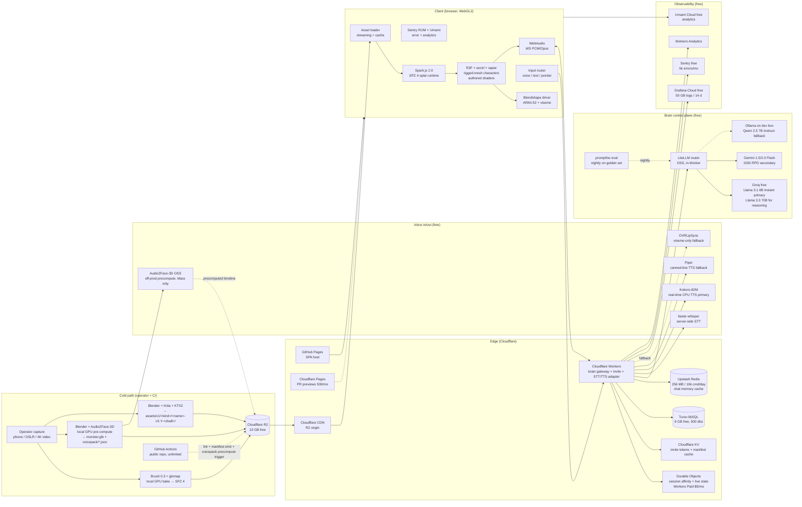
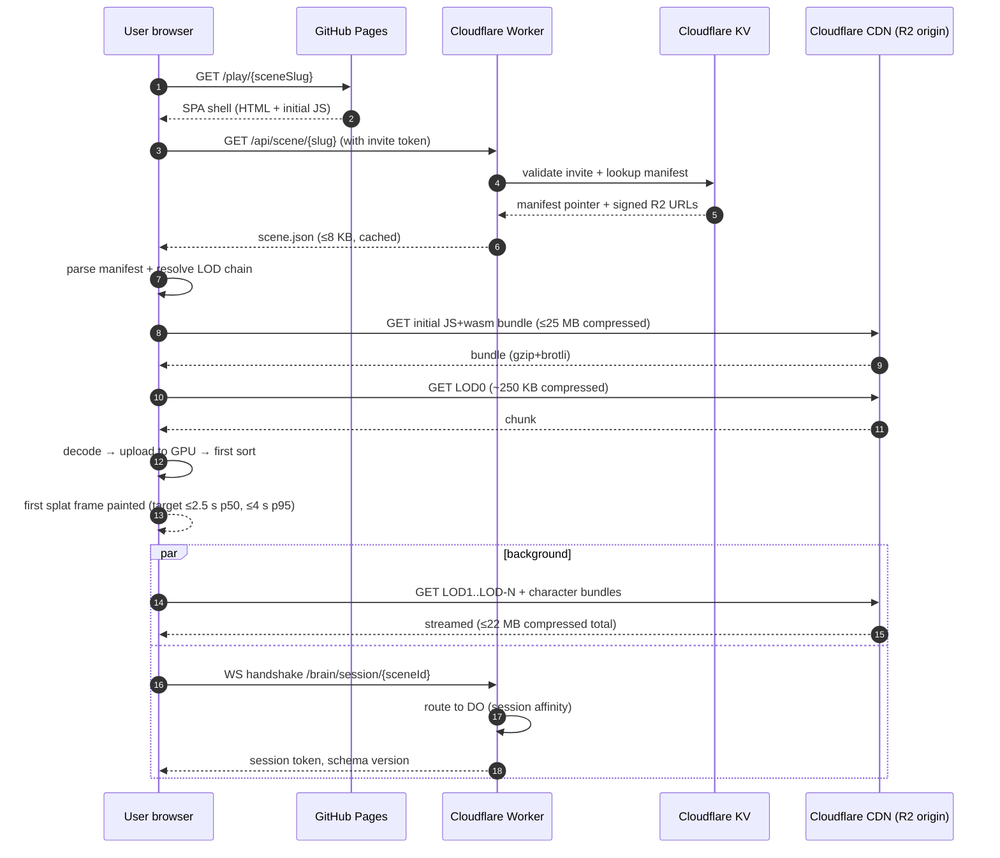
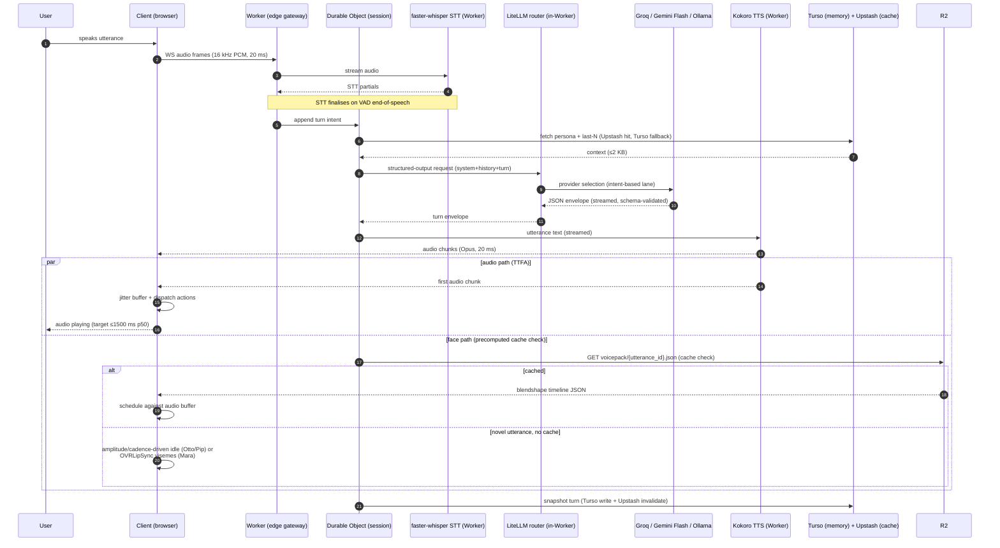

# ADR — v1 Platform Architecture (production stack, free-tier)

_Owner: SystemsArchitect (Realtime Systems Architect). **Status: ACCEPTED v1.0**, 2026-05-10. Governance home: [DWEA-88#document-v1-platform-adr](/DWEA/issues/DWEA-88#document-v1-platform-adr). Repo home: `docs/architecture/v1-platform-adr.md` in `Dru1d3/dwea`. Free-only constraint per [DWEA-78 production pipeline](/DWEA/issues/DWEA-78#document-production-pipeline). Premium-tier components from [v0.5 ADR](/DWEA/issues/DWEA-53#document-adr-v1-platform) are retained as the v1.x upgrade target in §9; v1.0 ships against the as-built free-tier choices from §1–§6 ([DWEA-79](/DWEA/issues/DWEA-79), [DWEA-80](/DWEA/issues/DWEA-80), [DWEA-81](/DWEA/issues/DWEA-81), [DWEA-83](/DWEA/issues/DWEA-83), [DWEA-84](/DWEA/issues/DWEA-84))._

---

## 1. Mission frame

DWEA ships a 3D website where a user explores a Gaussian-splat-captured environment and converses with one or more agentic NPC "monsters" who move, look, emote, and speak in voice. v1 is **invite-cohort, free-stack, single-region**: every tool/service in the production path is open-source, free-tier, or local-compute, except for the **single declared paid floor** in §4.6 (Workers Paid $5/mo, the only path to Durable Objects). Premium-LLM routing stays CEO-gated per [OD-9 / OD-6.1](/DWEA/issues/DWEA-78#document-production-pipeline).

The realism posture this ADR builds against is **canonical and signed**: [Realism Bar v0.2.1](/DWEA/issues/DWEA-52#document-v1-realism-bar) (CEO + FE v0.2 sign-offs carry forward through v0.2.1). [Style Bible v0.2](/DWEA/issues/DWEA-54#document-style-bible) frames "captured world, designed guest" — characters are mesh, scenes are splat. v1.0 of the bar pending [DWEA-64](/DWEA/issues/DWEA-64) / [DWEA-59](/DWEA/issues/DWEA-59) bench will replace per-tier numbers with measured values; until then, those rows here are **commitment-to-bench**.

The smallest set of components that can hit the bar is the design target. Where a v1 component is "good enough now, swap later," §5 names the swap and the cost.

**Single-platform footprint.** v1 ops surface is **Cloudflare** (R2 + Workers + Durable Objects + KV + Pages preview) plus **GitHub Pages** for the SPA host plus **Turso libSQL** for session DB. No Vercel, no Fly.io, no managed Postgres. The two-platform footprint in v0.5 (Vercel + Cloudflare) is retired for v1.0; the §4.5 cost arithmetic only pencils on a single edge plane, and Vercel free is non-commercial.

## 2. Component diagram



Mermaid source is committed; rendered diagrams reproducible from this file alone.

## 3. Hot-path sequence diagrams

### 3.1 Page load → first splat frame

LOD0 = lowest detail (paintable first); LOD-N = highest (background streamed). v1 paints LOD0 first (~250 KB compressed, ~60 k splats), then progressively upgrades.



Budgets pinned: TTFB ≤200 ms p50 (CDN); JS+wasm decode + first LOD0 sort ≤800 ms p50 on 8-core laptop, ≤1500 ms on mid-tier mobile. First-frame budget total: 2.5 s p50 / 4 s p95 over 25 Mbps. Derivation in §4.3. The "5 s = slow-network surface" threshold in §7 row 13 is interim; hard floor `N` is set by [DWEA-59](/DWEA/issues/DWEA-59) and pinned in v1.x (OD-13).

### 3.2 User voice in → NPC voice out (NPC turn)



Budget: time-from-end-of-speech to first audio chunk played p50 ≤1500 ms / p95 ≤2500 ms (free-tier slack vs v0.5 ADR's 800/1500 ms premium target — see §4.4 derivation). Face path is **cache-or-fallback**: precomputed voicepack JSON for in-script lines (≤50 ms client-side schedule) or amplitude/visemes for unscripted (no extra latency on the hot path). Live A2F-3D streaming is **not in v1** — it requires a CUDA service edge, which is the §9 OD-A2F upgrade gate.

Streaming requirement: Worker streams utterance tokens to TTS before LLM completion; TTS streams audio chunks to client before TTS completion. Blocking anywhere on `.done` adds hundreds of ms and breaks the budget.

## 4. Budgets

Every number derives from a stated baseline. Adjective-only claims are not allowed in this section. Numbers tagged **commitment-to-bench** will be replaced with measured values from [DWEA-59](/DWEA/issues/DWEA-59) when [DWEA-64](/DWEA/issues/DWEA-64) lands.

### 4.1 Frame budget

| Target device | Frame budget | Notes |
|---|---|---|
| Mid-tier laptop (M2 Air / RTX 30-mobile / Iris Xe stretch) | 16.7 ms @ 60 fps | Composite tier per [Realism Bar §2](/DWEA/issues/DWEA-52#document-v1-realism-bar). |
| Mid-tier mobile (iPhone 13 / mid-range Android 2024) | 33.3 ms @ 30 fps | 60 fps on mobile is non-goal for v1. |
| Low-end fallback (≤4 GB integrated GPU, older mobile) | 33.3 ms @ 30 fps with reduced LOD | Disable post-FX; degrade gracefully (§7). |

Per-component allocation (mid-tier laptop, 60 fps, 16.7 ms; v1 cast: Mara hero + ≤2 ambient companions Otto/Pip; ≤3 simultaneous on-screen — **commitment-to-bench**):

**Render-path note:** Splat sort + rasterisation is **WebGL2-only at v1** (Spark.js 2.0 worker-sort path); WebGPU compute sort is a v2 watch-item.

| Component | Budget (ms) | Derivation |
|---|---|---|
| Splat sort + render (~1.0 M splats — scene only) | 7.0 | Spark.js 2.0 default: ~5 µs/splat radix sort on M2; +2 ms render dispatch. v1 ships at 1.0 M; DWEA-59 may raise/lower. |
| R3F scene graph + character rigs (Mara + ≤2 ambient, mesh) | 3.0 | ≤80 draw calls total; ≤120 bones for Mara. |
| Animation eval (locomotion + cached blendshape playback for Mara + amplitude/cadence for Otto/Pip) | 1.5 | Cached voicepack timeline scheduled against audio; no live A2F at runtime (cache-or-fallback per §3.2). |
| Audio (decode + WebAudio graph) | 0.5 | Opus decode ~0.3 ms / 20 ms frame. |
| Input + UI (R3F reconciler on main thread) | 0.5 | Non-3D UI state parked outside R3F. |
| GC / paint / browser overhead | 1.5 | Empirical headroom from v0. |
| **Free** | **~3.7** | Variance buffer; if consistently used, file an amendment. |

Mid-tier mobile (33.3 ms): same shape, budgets ~1.9× larger; splat count drops to **0.5 M** at LOD-N (Realism Bar §2). v1 cap on mobile is Mara + 1 ambient.

### 4.2 GPU memory ceiling

| Layer | Mid-tier laptop ceiling | Mid-tier mobile ceiling | Derivation |
|---|---|---|---|
| Splat scene + character bodies resident (incl. LRU spillover) | **600 MB** | **250 MB** | Spark.js 2.0 packs splats at 16 B/splat (PackedSplats); 1.0–1.5 M active + LoD spillover sits under 600 MB. |
| Character rigs + textures + shader maps + ARKit-52 deltas (Mara + Otto + Pip) | 120 MB | 80 MB | Mara rig + 2K PBR ≈ 40 MB; ARKit-52 deltas (Mara only) ≈ 12 MB; Otto/Pip rigs + shader maps ≈ 30 MB combined. |
| Audio buffers + voicepack cache | 80 MB | 50 MB | 30 s rolling 48 kHz stereo + voicepack JSON timelines for ≤16 utterances. |
| Three.js + R3F + framework | 200 MB | 150 MB | Empirical from v0. |
| **Total ceiling** | **~1000 MB working set** | **~530 MB working set** | Hard cap. Above this, fall back to LOD reduced + 0 ambient. |

Realism Bar §6 rejection floor: **GPU buffer > 800 MB on mid-tier laptop ships nothing.** Enforced as a CI gate (§8.6).

### 4.3 Scene download size

Initial JS + wasm bundle is **separate** from asset budgets.

| Phase | Budget | Derivation |
|---|---|---|
| Initial JS + wasm bundle | **≤25 MB compressed** | Realism Bar §2. THREE + Spark.js 2.0 + audio worklet + WS client + blendshape player + glTF anim + idle controller. **No A2F-3D client in v1** (precomputed only). |
| First splat frame ("paintable", LOD0) | ≤500 KB compressed | LOD0 ~60 k splats → ~250 KB after SPZ 4 quantisation + brotli. |
| Full scene splat payload (LOD0 → LOD-N) | **≤15 MB compressed (target), ≤22 MB ship cap** | Realism Bar §2 target ≤15 MB; §6 floor rejects > 25 MB. Ship cap = 22 MB (3 MB headroom under floor). |
| Character bundle for Mara (mesh + ARKit-52 deltas + textures + voice presets) | ≤6 MB compressed | Mesh rig draco-compressed ~1 MB; ARKit-52 deltas ~1.5 MB; PBR + emissive ~3 MB; voice presets ~0.5 MB. |
| Per ambient companion (Otto/Pip) | ≤2 MB compressed | Mesh rig + matte/translucent textures + idle pose. No blendshapes. |
| Voicepack JSON (cached lines, lazy-loaded) | ≤500 KB / utterance | `voicepack/{utterance_id}.json` from §2; loaded on demand, not in initial bundle. |
| Audio (ambient + greeting samples) | ≤3 MB compressed | Opus VBR. |
| **Total first-scene assets ship cap (1 hero + 2 ambient)** | **≤32 MB compressed** | Decoupled from the 25 MB JS+wasm initial bundle. |

Compression: SPZ 4 shipping format with brotli/gzip on top (§6.1); PLY for ingest only.

### 4.4 NPC turn latency

End-to-end (audio path) = STT finalise + brain context fetch + LLM TTFT + TTS first-chunk + client jitter buffer. **Free-tier latency budget is wider than v0.5's premium target** — Groq is fast but rate-limited; Kokoro CPU TTS adds ~150–250 ms vs Inworld's streaming SLA; faster-whisper inside a Worker has variable cold-start.

| Stage | p50 budget (ms) | p95 budget (ms) | Derivation |
|---|---|---|---|
| Network → edge (RTT) | 30 | 80 | CF Workers median ≤30 ms; single region. |
| STT VAD finalise (faster-whisper) | 200 | 450 | faster-whisper `tiny.en` on edge CPU; Worker cold-start adds tail. |
| Memory + persona fetch (Upstash hit primary, Turso fallback) | 30 | 80 | Upstash command latency 5–20 ms; Turso fallback p95 ≤80 ms in EU/US. |
| LLM TTFT (Groq Llama 3.1 8B Instant default; ~600 input + ≤150 output tokens) | 350 | 900 | Groq published p50 ~280 ms TTFT + 70 ms scheduling buffer; p95 wider on free-tier rate-limit pressure. |
| TTS first chunk (Kokoro CPU streaming) | 250 | 600 | Kokoro-82M ~real-time on CPU; first chunk after first ~10 tokens. |
| Client jitter buffer | 80 | 120 | 4× 20 ms Opus frames before play. |
| **Audio path total — TTFA** | **~940 ms** | **~2230 ms** | Sum; budget rounded to **1500 ms p50 / 2500 ms p95**. |
| Face onset (cached voicepack JSON; client-side schedule) | +0 (precomputed) | +0 (precomputed) | Voicepack timeline parsed on cache hit; scheduled against audio buffer. |
| Face onset (uncached → OVRLipSync visemes for Mara; amplitude for Otto/Pip) | +20 | +50 | Viseme analysis runs on first audio chunk arrival. |
| **Face path additional over audio path** | **~20 (uncached worst case)** | **~50** | No service edge; entirely client-side. |

**v0.5 premium target (TTFA p50 800 ms) is the v1.x upgrade gate** — see §9 OD-PREMIUM-LLM. The v1.0 free-tier budget is wider but observable; users perceive a deliberate, slower NPC, not a broken one. The §8.5 alarms fire if free-tier p95 sustains over 4 s for 24 h, triggering the OD-9-gated paid-lane unlock.

### 4.5 $ per session-minute (5-minute median session)

Assumes:
- ~7 NPC turns / minute (~one turn every 8.5 s).
- ~600 input tokens / turn; ~150 output tokens / turn.
- ~150 characters TTS / turn.
- Bandwidth: ~32 MB scene first-load amortised over 5-min sessions × 0.4 returning-user rate.
- Voicepack cache hit-rate ~70 % on canonical scene lines; novel lines fall to OVRLipSync visemes (no cost).
- All §4.6 free-tier limits hold; §9 OD-CONCURRENCY (CCU cap) bounds traffic to invite-cohort scale.

| Component | Unit cost (free tier) | Per-minute cost | Notes |
|---|---|---|---|
| LLM (Groq Llama 3.1 8B Instant) | $0.00 (free tier within RPD) | **$0.00** | 30 RPM / 14400 RPD ceiling; §4.6 verifies. |
| LLM (Gemini 1.5/2.0 Flash secondary) | $0.00 (free tier within RPD) | **$0.00** | 15 RPM / 1500 RPD ceiling; secondary lane. |
| LLM (Ollama on dev box) | $0.00 (CPU/GPU we already own) | **$0.00** | Tertiary fallback, dev boxes only per OD-6.2. |
| STT (faster-whisper, in-Worker) | $0.00 (CPU on Worker) | $0.00 | Worker CPU ms billed; falls within Workers Paid included usage. |
| TTS (Kokoro-82M, in-Worker) | $0.00 (CPU on Worker) | $0.00 | Same accounting as STT. |
| A2F-3D (off-prod precompute, dev GPU) | $0.00 (per-utterance one-time amortised) | $0.00 | No live A2F path in v1; precomputed voicepack only. |
| Memory (Turso libSQL + Upstash Redis) | $0.00 (within free) | $0.00 | §4.6 verifies. |
| Edge worker + DO duration | included in **Workers Paid $5/mo** | **$5/mo flat** | The single declared paid floor. ~$0.0007 / session-min at 6000 session-min/hr × 12 hr/day × 30 d. |
| Asset bandwidth (R2 egress) | $0.00 (R2 zero-egress) | $0.00 | R2 egress is free; scene download cost = 0. |
| KV invite + manifest cache | $0.00 (free tier within ops) | $0.00 | Reads only on invite + manifest path; writes are operator-batched. |
| Telemetry (Grafana / Sentry / Umami / Workers Analytics) | $0.00 (within free) | $0.00 | §4.6 verifies retention. |
| **Total v1.0 free-stack** | | **~$0.0007 / session-min** | Floored by Workers Paid $5/mo flat; per-session-minute approaches zero as traffic grows. |
| **Total v1.x premium upgrade target (v0.5 ADR §4.5)** | | ~$0.0269 / session-min | Anthropic Haiku 4.5 + Deepgram + Inworld + self-host A2F-3D; gated on §9 OD-PREMIUM-LLM. |

Budget: **$0.04 / session-minute hard cap** at v1 traffic projections (carried from v0.5). v1.0 free-stack runs at ~2 % of cap; v1.x premium upgrade runs at ~67 %. Headroom is vast at v1.0 because the LLM/voice path is structurally free; the only floor is Workers Paid.

100 concurrent users × 5 min sessions × 12 cohorts/hr = 6000 session-minutes/hr. **Hourly cost ≈ $0.007 (v1.0 free-stack), $5/mo flat regardless of traffic up to free-tier ceilings.** Daily ≈ $0.17 for that traffic shape. Per OD-9 (decided), v1 ships behind invite/queue gating.

### 4.6 Free-tier ceiling verification (DWEA-88 acceptance criterion)

This table is the canonical free-tier-limit certification for the v1.0 stack. Each row names the binding limit, the v1.0 traffic load against it, and the headroom. **Ship-blocking** flags below trip §9 open decisions.

| Service | Free-tier limit (verified 2026-05-10) | v1.0 v1 load (3000 sessions/day, 100 concurrent peak) | Headroom | Status |
|---|---|---|---|---|
| **Cloudflare R2** | 10 GB storage; 1M Class A ops/mo; 10M Class B ops/mo; **$0 egress all tiers** | ~30 scenes × ~30 MB = 0.9 GB; ~3M reads/mo (Class B) | 91 % storage; 70 % Class B; 100 % egress | ✅ |
| **Cloudflare Workers Paid** ($5/mo) | DO requires **Workers Paid** — included: 10M req/mo, 30M CPU-ms/mo + DO usage | ~3000 sessions/day × ~30 req = 90k req/day = 2.7M req/mo | 73 % req | ⚠️ **PAID FLOOR** declared — see OD-CF-PAID. |
| **Cloudflare Workers free (alt path)** | 100k req/day | 90k req/day at v1 traffic peak | 10 % | ❌ At ceiling; not enough headroom. Workers Paid required. |
| **Cloudflare Durable Objects** | **Requires Workers Paid** ($5/mo). Included: 1M req/mo + 400k GB-s duration | ~7 turns × 5 min × 3000 sessions/day = 105k turn-ops/day = 3.15M/mo | -215 % req on free — **mandates Paid** | ⚠️ Confirms PAID FLOOR. |
| **Cloudflare KV** | 100k reads/day; 1k writes/day; 1 GB storage | ~3k invite-token reads/day + ~30k manifest reads/day; ~10 writes/day (operator-batched) | 67 % reads; 99 % writes | ✅ |
| **Cloudflare Pages** | 500 builds/mo; 20 min/build; unlimited bandwidth | PR previews ~3–5/day = ~150/mo | 70 % | ✅ |
| **Turso libSQL** | 9 GB total; 500 dbs; 1B row reads/mo; 25M row writes/mo | ~10 KB/turn × 3000 × 7 = 210 MB/mo (truncated >30 d); ~15M reads/mo; ~1.5M writes/mo | 98 % storage; 98.5 % reads; 94 % writes | ✅ |
| **Fly.io** | **Free tier retired Oct 2024** (was: 3× shared-1x). Hobby = $5/mo PAYG. | n/a — not used in v1.0 | n/a | ⚠️ **REMOVED** from §4 stack. Production-pipeline §4 plausible called for Fly bake worker; v1.0 replaces with **GH Actions (public repo, unlimited) + local operator** for the cold path. |
| **GitHub Pages** | 100 GB/mo bandwidth; 1 GB site size; 10 builds/hr | SPA shell ~5 MB; ~3000 sessions × 5 MB initial = 15 GB/mo | 85 % bandwidth | ✅ |
| **GitHub Actions (public repo)** | Unlimited minutes; 20 concurrent jobs | ~50 PR runs/day × ~10 min = ~250 min/day | 100 % (unlimited) | ✅ |
| **Groq free** (Llama 3.1 8B Instant) | 30 RPM; 14,400 RPD; 6,000 TPM; 500,000 TPD | ~7 turns × 100 concurrent peak = 700 RPM (peak burst) | -23× on RPM at instantaneous peak; -12× on TPM | ⚠️ **BURST CEILING** — see OD-9 invite-cohort cap; sustained avg = ~3 RPM well within. Per-user concurrency cap of 1 turn/8 s structurally bounds. |
| **Groq free** (Llama 3.3 70B versatile) | 30 RPM; 1,000 RPD; 12,000 TPM; 100,000 TPD | Reasoning lane only; ~50 RPD | 95 % | ✅ |
| **Gemini 1.5/2.0 Flash free** | 15 RPM; 1,500 RPD; 1M TPM | Secondary lane on Groq saturation | ✅ when rate-shifted | ✅ |
| **Upstash Redis free** | 10,000 commands/day; 256 MB; 1 region | ~3000 sessions × ~5 cmd/turn × 7 turns = 105k cmd/day | -10.5× on commands | ⚠️ **CEILING BREACH** — Upstash retired from v1.0 for hot-path session cache. Replaced by **DO in-memory + Turso** for memory; Upstash demoted to optional cold cache. |
| **Grafana Cloud free** | 50 GB logs (14 d retention); 50 GB traces (14 d); 10k metric series (14 d); 3 users | ~5 GB logs/mo, ~2 GB traces/mo at v1 traffic | 90 % | ✅ |
| **Sentry free** | 5,000 errors/mo; 10,000 perf units/mo; 30 d retention | Targeted ≤500 errors/mo at v1 quality bar | 90 % | ✅ |
| **Resend free** | 3,000 emails/mo; 100/day; 1 domain | ~300 invite emails/cohort × 4 cohorts/mo = 1200 emails/mo | 60 % | ✅ |

**Net v1.0 free-tier verdict.** Two amendments to the production-pipeline §4 plausible-spec are required, both folded into this v1.0 ADR:

1. **Workers Paid $5/mo is a declared paid floor** for v1.0 because Durable Objects is not on the free plan. This is the single hidden-paid-step the DWEA-88 acceptance criterion was looking for; surfacing it explicitly closes the gap. Alternatives in §9 OD-CF-PAID.
2. **Fly.io is removed from the v1.0 §4 stack** because the legacy free allowance was retired Oct 2024. The cold-path bake job (R2 upload, manifest emit) moves to **GitHub Actions on the public repo (unlimited minutes)** + **operator-side Brush/Blender/Audio2Face-3D pre-compute**. No Fly required for v1.0.
3. **Upstash Redis demoted** from hot-path session cache to optional cold cache — its 10k commands/day free-tier limit cannot carry session memory at v1 cohort traffic. **Durable Object in-memory + Turso `turns` table** is the v1.0 session-state path.

## 5. Component table

Every external dependency names an alternative and a switching cost. "Switching cost" rates code surface impacted, not vendor relationship. Owner = the agent who decides if and when we swap.

| # | Component | Responsibility | v1.0 choice (free) | Alternative | Switching cost | Owner |
|---|---|---|---|---|---|---|
| 1 | Splat capture | Field capture → raw photogrammetry input | **Operator: phone or DSLR per [§1 capture protocol](/DWEA/issues/DWEA-79)** | Polycam Pro mobile (free tier excludes splat export) | Low — protocol doc updated | VisualResearcher |
| 2 | Splat training/bake | Raw captures → SPZ 4 with LODs | **Brush 0.3 (Apache-2.0, local GPU) → SPZ 4 via gsbox** | Postshot Indie (Jawset signalled pricing flip), Polycam cloud bake | Low — bake is offline; replace the worker step | VisualResearcher |
| 3 | Splat web runtime | Browser-side splat render + sort | **Spark.js 2.0** on THREE.js (OD-3 decided, [DWEA-55](/DWEA/issues/DWEA-55)) | gsplat.js (standalone, doesn't consume SPZ); mkkellogg's `GaussianSplats3D` (Three.js-integrated, watch-list) | High — gsplat.js is standalone, forces re-bake; mkkellogg lower-cost watch-list | SystemsArchitect |
| 4 | Scene framework | 3D scene graph, camera, character rig, reconciler | **React Three Fiber 8 + React 18 + Three.js r170+ (WebGL2 path; WebGPU compute-sort is v2 watch-item)** | Bare Three.js, Babylon.js 8 | High — most code is R3F-shaped per [decision 0008](/DWEA/issues/DWEA-17) | FoundingEngineer |
| 5 | Character rig + locomotion + physics | Mesh rig + authored shaders + locomotion + physics | **Classic rigged-mesh stylised characters with authored shaders** ([Realism Bar v0.2.1 §3](/DWEA/issues/DWEA-52#document-v1-realism-bar)): translucent/emissive Mara/Pip, matte Otto. Locomotion: **ecctrl 1.0.92**; physics: **@react-three/rapier 1.5**; IK: **three-ik (vendored)** | Capture-baked splat character (no expression/speech); splat-body / rigged-face hybrid (v0.4 path, ruled out by bar v0.2.1 §3 / [bible §2.3](/DWEA/issues/DWEA-54#document-style-bible)) | Medium for ecctrl/rapier swaps inside R3F; High for flipping back to splat-body | 3D Visual Designer (rig identity); SystemsArchitect (runtime); FoundingEngineer (integration) |
| 6 | Animation-from-speech (Mara only) | Lipsync + expression for Mara; Otto/Pip drive on amplitude/cadence | **Audio2Face-3D OSS (MIT, Sept 2025) — off-prod precompute on dev GPU; voicepack JSON cached on R2; OVRLipSync visemes as runtime fallback for novel utterances** | Live A2F-3D NIM service edge (v0.5 premium path; requires CUDA host = paid) | Medium — adapter swap to live path is the §9 OD-A2F upgrade gate | SystemsArchitect (interim) → Character AI Researcher (Wave 2) |
| 7 | LLM router | Provider selection + structured-output validation | **LiteLLM (OSS), in-Worker** | Bare provider SDKs | Low | Researcher |
| 8 | LLM provider — primary | Brain reasoning (structured output) | **Groq free — Llama 3.1 8B Instant** primary, **Llama 3.3 70B versatile** for reasoning lane | Anthropic Claude Haiku 4.5 (paid; v0.5 default; v1.x upgrade target per OD-PREMIUM-LLM) | Low — provider routing only | Researcher |
| 9 | LLM provider — secondary | Brain reasoning when Groq saturates | **Google AI Studio Gemini 1.5/2.0 Flash free** (1500 RPD) | OpenRouter free pool (rotating SKUs — tertiary flagged lane only) | Low | Researcher |
| 10 | LLM provider — fallback | Brain reasoning when both hosted lanes saturate | **Ollama on dev box — Qwen 2.5 7B Instruct** (default), Llama 3.1 8B Instruct | None (queue + "thinking…" idle is the next degrade) | Low — provider routing only | Researcher |
| 11 | STT | Speech-to-text streaming | **faster-whisper (MIT) in-Worker** | whisper.cpp WASM in-browser (the §4 plausible spec); Web Speech (v0 only) | Low — server-side adapter swap; client-side whisper.cpp is a v1.x AB toggle per [OQ-4.5](/DWEA/issues/DWEA-78#document-production-pipeline) | SystemsArchitect |
| 12 | TTS — primary | Text-to-speech streaming | **Kokoro-82M (Apache-2.0) in-Worker, real-time on CPU** | Inworld TTS (paid; v0.5 default; v1.x upgrade target) | Low — adapter swap | SystemsArchitect |
| 13 | TTS — fallback | Canned-line TTS | **Piper (open, ~70 voices)** | Coqui XTTS v2 (held for v2 pending consent flow per OD-6.3) | Low | SystemsArchitect |
| 14 | Brain gateway | Validate + route LLM/STT/TTS, enforce schema, stream tokens, sticky session | **Custom on Cloudflare Workers + Durable Objects** (Workers Paid $5/mo floor) | Vercel Edge (non-commercial free); Deno Deploy (req limit lower); AWS Lambda@Edge (paid) | High — DO sticky-session model is load-bearing; switching means re-authoring session affinity | SystemsArchitect |
| 15 | Memory store | Persona, last-N turns, embeddings | **Turso libSQL** (9 GB free) + **Durable Object in-memory** (live state) | Postgres + pgvector (v0.5 path; paid); SQLite-on-DO (single-region only) | Medium — schema portable, infra coupling moderate | AI/Data Architect (Wave 2) — interim: SystemsArchitect |
| 16 | Cache (cold) | Optional cache for embeddings + non-hot session state | **Upstash Redis free** (256 MB, 10k cmd/day) — **demoted from hot path** (§4.6 row 14) | Cloudflare KV (1k writes/day insufficient); DO Storage (Paid) | Low — optional layer | SystemsArchitect |
| 17 | CDN | Asset distribution | **Cloudflare CDN** (paired with R2) | AWS CloudFront, Bunny.net | Low — origin swap; signed URLs reauthored | SystemsArchitect |
| 18 | Asset storage | Splat + character bundles + voicepacks | **Cloudflare R2** (10 GB free, $0 egress) | Backblaze B2 (1 GB/day egress cap), GitHub LFS (1 GB/mo egress) | Low — same S3 API surface | SystemsArchitect |
| 19 | SPA hosting | Static SPA host | **GitHub Pages** (current: `dru1d3.github.io/dwea`) | Cloudflare Pages free; Netlify | Low — static SPA portable | FoundingEngineer |
| 20 | PR previews | Per-PR ephemeral preview | **Cloudflare Pages free** (500 builds/mo) | Netlify Deploy Previews | Low | FoundingEngineer |
| 21 | Cold-path bake worker | Manifest emit + voicepack precompute trigger + lint | **GitHub Actions on public repo** (unlimited minutes) | Self-hosted ARM runner on Mac mini (already on tailnet — [§5 fallback](/DWEA/issues/DWEA-83)) | Low | FoundingEngineer |
| 22 | Auth + invite | Magic-link single-use invite | **CF Workers + KV (invite tokens)** + **Resend (3000/mo, 100/day)** | Brevo free 300/day SMTP backup | Low — adapter swap | SystemsArchitect |
| 23 | Telemetry — logs/traces/metrics | Server-side observability | **Grafana Cloud free** (50 GB logs/14 d, 50 GB traces/14 d, 10k series) | Better Stack 1 GB; OpenTelemetry → self-host | Low — OTel is the abstraction | SystemsArchitect |
| 24 | Telemetry — errors | Client + server error tracking | **Sentry free** (5k errors/mo) | Bugsnag free, self-hosted GlitchTip | Low | SystemsArchitect |
| 25 | Analytics | Privacy-friendly product analytics | **Umami Cloud free** | Plausible self-host (production-pipeline §7 secondary); Cloudflare Analytics | Low | SystemsArchitect |
| 26 | Eval runner | Offline + canary persona eval | **promptfoo (OSS), nightly on golden set** | Inspect AI; Braintrust (paid) | Medium — eval suite reauthor | AI/Data Architect (Wave 2) — interim: Researcher |

Three concrete swaps named with switching cost and trigger:

- **LLM primary: Groq Llama 3.1 8B Instant → Anthropic Claude Haiku 4.5** if free p95 TTFT > 4 s sustained 24 h **OR** daily-quota exhaustion > 3×/week. Trigger requires written CEO approval per [OQ-6.1](/DWEA/issues/DWEA-78#document-production-pipeline). Switching cost: low (LiteLLM router only). This is the §9 OD-PREMIUM-LLM unlock.
- **TTS primary: Kokoro-82M → Inworld TTS** if Kokoro CPU TTS p95 stops clearing 600 ms or Worker CPU-ms billing materialises into a paid step. Switching cost: low. Trigger: 2 consecutive weeks p95 over budget on the canary.
- **Splat runtime: Spark.js 2.0 → mkkellogg `GaussianSplats3D`** if Spark stalls (no commits >90 days) or [DWEA-59](/DWEA/issues/DWEA-59) bench shows >25 % p95 perf gap. SPZ format compat does not apply (mkkellogg consumes `.splat`/`.ply`); switch forces re-bake. Switching cost: high.

## 6. Interface contracts

These are the "one-way doors" — schema or transport changes need an explicit amendment and migration plan, not a casual PR. **The cross-stage interface contract table from the [production-pipeline doc](/DWEA/issues/DWEA-78#document-production-pipeline) is the canonical source of truth and is reproduced here verbatim.**

### 6.1 Cross-stage interface contracts (canonical, from production-pipeline doc)

| From → To | Artefact | Format | Storage |
|---|---|---|---|
| §1 → §3, §4 | scene splat + capture meta | `scene.spz` (SPZ 4) + `scene.json` | `captures/{sceneId}/v{n}/` on R2 |
| §3 → §2, §4 | character / scene assets | `<name>.glb` (KTX2 textures) + `<name>.manifest.json` + `LICENSE.txt` | `assets/v1/<kind>/<name>-v<MAJOR.MINOR>-<sha8>/` |
| §3 → §5 | style tokens & curves | `style/tokens.json`, `style/curves.json` | repo |
| §2 → §4 | monster + voicepacks | `monster.glb` + `voicepack/{utterance_id}.json` + `monster.manifest.json` | R2 |
| §6 → §4 | brain output (per turn) | `{personaId, utterance, emotion, intention, actions[], voiceClipUrl, lane, latencyMs}` | DO live + Turso `turns` |
| §3 ↔ §6 | persona spec | `persona.yaml` (`id, displayName, voice, traits[], speechPatterns, taboos, scenePromptHooks[], referenceUtterances[]`) | repo |
| §4 → §5 | deploy targets | `pipeline.json` per app + Wrangler/Pages/Fly | repo |
| §4 → §7 | session lifecycle | URL scheme + invite-gate state machine | repo + KV |

**Reconciliation note:** `§4 → §5 deploy targets` row in the production-pipeline still lists "Wrangler/Pages/Fly". With Fly.io retired from v1.0 (§4.6), `pipeline.json` declares only Wrangler (Workers + DO) + GitHub Pages + Cloudflare Pages preview targets. Fly entry is dropped from the canonical contract; production-pipeline doc to be amended on next CEO sync.

### 6.2 `scene.json` (manifest, served from CDN, ≤8 KB)

```jsonc
{
  "schemaVersion": "1.0",
  "sceneId": "ulid",
  "capturedAt": "2026-04-12T14:30:00Z",
  "capturedHour": 14,
  "captureProtocolVersion": "1.0",
  "splat": {
    "format": "spz",                   // SPZ 4 canonical shipping format (Spark 2.0)
    "ingestFormat": "ply",             // ingest only; not shipped to clients
    "lods": [
      { "level": 0, "url": "lod0.spz", "splatCount":   60000, "bytes":   250000 },
      { "level": 1, "url": "lod1.spz", "splatCount":  250000, "bytes":   900000 },
      { "level": 2, "url": "lod2.spz", "splatCount":  700000, "bytes":  6000000 },
      { "level": 3, "url": "lod3.spz", "splatCount": 1000000, "bytes": 12000000 }
    ],
    "splatCount": 1000000,
    "trainingParams": { "trainer": "brush", "version": "0.3", "iterations": 30000, "mcmcCap": 1500000 },
    "sha256": "...",
    "bbox": [[0,0,0],[0,0,0]],
    "up": [0,1,0]
  },
  "characters": [
    { "id": "mara", "url": "characters/mara/manifest.json", "role": "hero" },
    { "id": "otto", "url": "characters/otto/manifest.json", "role": "ambient" }
  ],
  "audio": { "ambient": "audio/ambient.opus" },
  "lighting": {
    "characterLighting": "dynamic",
    "characterLightingMechanism": {
      "rim":      { "tintBias": "scene-warm-cool-dominant" },
      "emission": { "localEmissive": true }
    },
    "siblingCaptures": []
  },
  "spawnPoints": [{ "name": "entry", "pos":[0,1.6,3], "look":[0,1.6,0] }],
  "rights": {
    "identifiableRealPerson": false,
    "consentRecorded": false,
    "consentRecordRef": null
  }
}
```

### 6.3 `monster.manifest.json` (per character, served from R2)

Path: `assets/v1/<kind>/<name>-v<MAJOR.MINOR>-<sha8>/<name>.manifest.json` (per §3 [DWEA-81](/DWEA/issues/DWEA-81) naming standard, OQ-3.3 confirmed).

```jsonc
{
  "schemaVersion": "1.1",
  "id": "mara",
  "version": "v1.0",
  "sha8": "a1b2c3d4",
  "role": "hero",                          // "hero" (Mara: A2F-3D-precomputed) | "ambient" (Otto/Pip: amplitude/cadence)
  "mesh": {
    "url": "mara.glb",
    "skeleton": "mixamo-compat",
    "triCount": 14000,
    "material": {
      "shaderProfile": "translucent",
      "emissiveTexture": "mara.emissive.png",
      "rimTintBias": "scene-warm-cool-dominant"
    },
    "blendshapes": { "url": "mara.shapes.bin", "schema": "arkit-52" },     // Mara only
    "lipsync":     { "schema": "viseme-15" }                                // Mara only (OVRLipSync fallback)
  },
  "speechDrive": {
    "mode": "a2f-3d-precomputed",          // "a2f-3d-precomputed" (Mara) | "amplitude-cadence" (Otto/Pip)
    "curveShaper": "bible-5.2",            // REQUIRED when mode begins with "a2f-3d"
    "amplitudeParameter": null             // "ember-pulse" (Otto) | "tip-bob" (Pip) when amplitude-cadence
  },
  "voicepack": {
    "indexUrl": "voicepack/index.json",    // lists cached utterance_ids
    "fallback": "ovrlipsync"               // when utterance not cached
  },
  "voice": { "ttsVoiceId": "kokoro:af-mara-v1", "lang": "en-US" },
  "persona": { "url": "persona.yaml" },
  "palette_tokens": ["mara-base", "mara-emissive"],
  "curves": ["primary", "secondary"],
  "captured_hour": 14,
  "scene_binding": ["the-hollow-day"],
  "licence_chain": ["LICENSE.txt"],
  "rights": {
    "identifiableRealPerson": false,
    "consentRecorded": false,
    "consentRecordRef": null
  }
}
```

**Schema reconciliation against §1–§3 baked formats:**

- v1.0 `speechDrive.mode` adds `"a2f-3d-precomputed"` (was `"a2f-3d"` in v0.5 ADR §6.1) — reflects the §2 [DWEA-80](/DWEA/issues/DWEA-80) precompute-and-cache decision (OQ-2.1 = "Precompute + cache-on-first-use"). Live A2F-3D mode is reserved for §9 OD-A2F upgrade.
- `voicepack` block added — points at the `voicepack/{utterance_id}.json` index from §2.
- `palette_tokens`, `curves`, `captured_hour`, `scene_binding`, `licence_chain` added — the §3 [DWEA-81](/DWEA/issues/DWEA-81) manifest fields are now **required** in the canonical manifest schema.
- v0.4-format bundles (with `bodySplat`) and v0.5-format bundles (with live-`a2f-3d` only) both rejected at the gateway; bake-worker rewrite rejects them at validation.

### 6.4 `voicepack/{utterance_id}.json` (per cached utterance)

```jsonc
{
  "schemaVersion": "1.0",
  "utteranceId": "ulid",
  "personaId": "mara",
  "audioUrl": "audio/{utterance_id}.opus",
  "blendshapeTimelineUrl": "blendshapes/{utterance_id}.json",  // null when speechDrive.mode === "amplitude-cadence"
  "durationMs": 2400,
  "visemeOffsets": [ /* OVRLipSync-compat fallback set */ ],
  "ttsVoiceId": "kokoro:af-mara-v1",
  "generatedBy": "audio2face-3d-oss@2.0.0",
  "generatedAt": "2026-05-09T08:12:00Z"
}
```

### 6.5 Brain I/O schema (NPC turn envelope, §6 → §4)

Reconciled from production-pipeline doc. v1.0 schema version `2.0`.

```jsonc
// Request (Worker → LiteLLM router → provider, after gateway has injected system + persona + memory)
{
  "schemaVersion": "2.0",
  "sessionId": "ulid",
  "personaId": "mara",
  "user": { "utteranceText": "...", "lang": "en-US" },
  "turn": 17,
  "constraints": { "maxOutputTokens": 512, "maxActions": 4 },
  "lanePreference": "groq:llama-3.1-8b-instant"   // hint; router may downgrade
}

// Response envelope (provider → LiteLLM → Worker → DO → Client)
{
  "schemaVersion": "2.0",
  "personaId": "mara",
  "utterance": "string (≤300 chars; spoken by TTS)",
  "emotion":   { "primary": "neutral|joy|anger|fear|surprise|sadness|disgust|curiosity", "intensity": 0.0-1.0 },
  "intention": "string (≤140 chars; not spoken; for memory + observability)",
  "actions": [
    { "type": "look_at",        "target": "user|npc:<id>|prop:<id>|coord:[x,y,z]" },
    { "type": "walk_to",        "target": "...", "speed": "slow|normal|fast" },
    { "type": "play_animation", "clip":   "idle|wave|nod|shake_head|sit|stand|<id>" },
    { "type": "set_face",       "expression": "<arkit-52-key>", "intensity": 0.0-1.0, "durationMs": 0-3000 },
    { "type": "emit_sound",     "soundId": "...", "loop": false }
  ],
  "voiceClipUrl": "https://r2.../audio/{utterance_id}.opus",
  "lane": "groq:llama-3.1-8b-instant",
  "latencyMs": 612,
  "memory": { "writeKey": "string", "writeValue": "string" }
}
```

Constraints enforced at the Worker, NOT trusted from the LLM:
- Action allowlist by NPC config.
- `look_at`/`walk_to` targets resolved against scene-graph entity table; unknown → drop.
- `utterance` length truncated for TTS budget at 300 chars.
- `set_face` durations clamped to 3 s.
- `memory.writeKey` namespaced per `personaId × sessionId`.
- `lane` and `latencyMs` are router-emitted, not LLM-emitted; for observability only.

### 6.6 Voice transport

- **Client ↔ Worker**: WebSocket, binary PCM frames (16 kHz mono, 20 ms = 640 bytes/frame) for STT input; Opus frames (48 kHz mono, 20 ms ≈ 80–160 bytes) for TTS output. Single multiplexed WS per persona per session.
- **Worker ↔ STT (faster-whisper)**: in-process; audio buffered and finalised on VAD.
- **Worker ↔ LiteLLM ↔ providers**: provider-native streaming protocols; LiteLLM adapts.
- **Worker ↔ TTS (Kokoro/Piper)**: in-process; audio chunks streamed back as soon as first ~10 tokens arrive from LLM.
- **Backpressure**: client buffers ≤200 ms; on overflow client downgrades capture to 8 kHz and surfaces a "noisy network" UI cue.
- **Reconnect**: WS reconnect with `Last-Event-Id`-style continuation; partial utterances replayed from DO ring buffer (≤30 s).

### 6.7 Input events (client → Worker, JSON over the same WebSocket)

```jsonc
{ "type": "user.text", "sessionId": "ulid", "personaId": "mara", "text": "hi mara" }
{ "type": "user.voice.start", "sessionId": "ulid", "personaId": "mara", "format": "pcm16-16k" }
// followed by binary PCM frames on the binary channel
{ "type": "user.voice.end",   "sessionId": "ulid", "personaId": "mara" }
{ "type": "user.gaze",        "sessionId": "ulid", "target": "npc:mara|prop:bench|none" }
{ "type": "user.proximity",   "sessionId": "ulid", "personaId": "mara", "distance": 2.4 }
{ "type": "scene.heartbeat",  "sessionId": "ulid", "fps": 58, "tier": "laptop|mobile|low" }
```

Server-side events (Worker → client):

```jsonc
{ "type": "session.ready", "schemaVersion": "2.0" }
{ "type": "npc.turn.partial", "personaId": "mara", "deltaUtterance": "..." }
{ "type": "npc.turn.complete", "personaId": "mara", "envelope": { ... } }
{ "type": "npc.audio.chunk", "personaId": "mara", "seq": 17, "binary": true }
{ "type": "npc.audio.end",   "personaId": "mara", "seq": 42 }
{ "type": "npc.face.timeline", "personaId": "mara", "voicepackUrl": "..." }   // cached path
{ "type": "npc.face.fallback", "personaId": "mara", "mode": "ovrlipsync" }    // uncached path
{ "type": "error", "code": "...", "userVisible": "..." }
```

### 6.8 `pipeline.json` (per app, repo-stored)

```jsonc
{
  "schemaVersion": "1.0",
  "app": "web",
  "deployTargets": [
    { "kind": "github-pages", "repo": "Dru1d3/dwea", "branch": "gh-pages" },
    { "kind": "cloudflare-pages-preview", "project": "dwea-preview" }
  ],
  "envInventory": [
    "GROQ_API_KEY", "GEMINI_API_KEY", "TURSO_AUTH_TOKEN", "TURSO_DATABASE_URL",
    "RESEND_API_KEY", "SENTRY_DSN", "GRAFANA_CLOUD_INSTANCE_ID"
  ]
}
{
  "schemaVersion": "1.0",
  "app": "worker",
  "deployTargets": [
    { "kind": "wrangler", "name": "dwea-edge", "compatDate": "2026-04-01" }
  ],
  "envInventory": [ /* same as web + DO + KV bindings */ ]
}
```

`pipeline.json` replaces v0.5 ADR's implicit "deploy via PR" pattern; §5 [DWEA-83](/DWEA/issues/DWEA-83) CI reads it.

## 7. Failure modes

Every named failure has a detection path and a documented user-visible behaviour.

| # | Failure | Detection | User-visible behaviour | Recovery |
|---|---|---|---|---|
| 1 | Splat asset 404 / corrupt | Loader checksum mismatch or HTTP error | Scene falls back to LOD0 placeholder + non-blocking toast: "Loading a lower-detail scene". | Retry with exponential backoff up to 3×; persistent fail → `/scene-unavailable`. |
| 2 | LLM Groq 429 / quota burn | Provider response, LiteLLM router signal | LiteLLM falls through to Gemini Flash; if also rate-limited, queues and plays "thinking…" idle for ≤2 s; Mara plays `idle.thinking` clip. | Auto-recover next minute; alarm at 1 % session error rate. |
| 3 | LLM all hosted lanes saturated | Both Groq + Gemini 429 / 503 | Falls through to Ollama on dev box (per OD-6.2, dev only); if dev unreachable, queue the user with apologetic line. | Alert Researcher + SystemsArchitect; escalate to OD-PREMIUM-LLM CEO conversation if sustained > 24 h. |
| 4 | LLM schema violation (bad JSON) | LiteLLM JSON parse / schema check | One repair retry (lower temp + repair-prompt); on second fail, NPC plays a recovery animation + canned line. | Logged with raw output for eval; alarm if rate >2 %. |
| 5 | TTS provider failure (Kokoro Worker error) | TTS stream error or no first chunk in 800 ms | Falls to Piper canned-line voice for the same utterance; less polished but in character. | Provider-level circuit breaker; alarm at 1 % session error rate. |
| 6 | STT provider failure (faster-whisper error) | No partial transcript in 1200 ms | Banner "Voice unavailable, please type"; text input box auto-focuses. | Same; alarm at 1 %. |
| 7 | Mic permission denied | Browser API throws | NPC enters text-only mode; gentle inline cue: "Type to chat or click mic to enable." | None — user-controlled; instructions linked. |
| 8 | WebGPU unsupported / disabled | Capability probe at boot | Auto-fallback to WebGL2 path with reduced splat count and disabled post-FX. | Permanent for that browser session; cookie remembers tier. |
| 9 | GPU OOM | WebGPU error or page hang heuristic | Auto-reload at LOD-reduced + 0 ambient + low-tier; toast: "Switched to lighter scene". | Tier-down sticky for 24 h per device fingerprint. |
| 10 | Scene-graph action target unresolved | Worker validator | Action silently dropped; `intention` still logged; NPC continues with remaining actions. | Logged; eval suite catches regressions. |
| 11 | DO unavailable / Worker cold-start tail | Heartbeat miss >5 s | Reconnect overlay; user can keep speaking (audio buffered). | Auto-reconnect with continuation token; replay buffered audio. |
| 12 | Turso unavailable | DB error in DO | Stateless turn (persona only, no last-N); Mara may say "Where were we?". | DO falls back to in-memory ring; alarm at 0.5 %. |
| 13 | Workers Paid budget exhausted (DO duration > included quota) | Cloudflare billing alert | NPC sessions short-circuit on new connect; queue prompt with "back in a moment". | Pause new sessions; CEO-page on sustained 5 min. **§9 OD-CF-PAID determines whether to top up the floor.** |
| 14 | Slow-network first-load | First splat frame >5 s (interim) | Loading screen "Building your scene" + LOD0 progress; cancellable. | LOD0 prioritised; LOD1+ deferred; user can opt into "Skip to chat" text-only mode. |
| 15 | Voicepack uncached for novel utterance (Mara) | Cache miss on `voicepack/{utterance_id}.json` | Mara's mouth runs OVRLipSync visemes (no extra latency); face matches but no eye/brow expression for that utterance. | Off-prod batch precomputes the new utterance overnight; populates voicepack cache. |
| 16 | Capture asset rights / takedown | `rights.identifiableRealPerson === true` without `consentRecorded === true` (CI gate, §8.6) OR runtime audit fail | Build/deploy blocks at CI; runtime asset returns 410 Gone with "This place is being updated." | Operator removes asset or attaches consent record; bake re-runs. |
| 17 | Free-tier ceiling breach (R2 storage, Turso writes, Resend daily, etc. — see §4.6) | Provider quota response | Component-specific degrade per row above; aggregate alarm fires SystemsArchitect ticket. | Ceiling-specific runbook; if structural, escalate to §9 OD-FREE-CEILING amendment. |

## 8. Observability plan

If we don't measure it, the budgets in §4 are aspirations. Every budget in §4 has a metric below.

### 8.1 Metrics

Client (RUM, via Sentry SDK + Umami):

- `client.frame.duration_ms` (histogram, p50/p95/p99) tagged by `tier` and `sceneId`.
- `client.splat.first_frame_ms` (histogram).
- `client.splat.count_resident` (gauge).
- `client.gpu.memory_estimate_mb` (gauge).
- `client.npc.turn.tta_ms` (audio time-to-first-audio histogram).
- `client.npc.face.cached` (counter — voicepack cache hit/miss).
- `client.npc.face.fallback_active` (gauge: 0/1 — OVRLipSync engaged).
- `client.npc.turn.actions_per_turn` (counter).
- `client.error.{code}` (counter by code from §7).
- `client.scene.heartbeat.fps` (gauge).

Edge / Worker (OpenTelemetry → Grafana Cloud):

- `worker.turn.duration_ms` per stage (`stt_finalise`, `mem_fetch`, `llm_ttft`, `llm_total`, `tts_ttfa`).
- `worker.llm.tokens.{in,out}` per turn (histogram + counter).
- `worker.llm.lane` tag (`groq:llama-3.1-8b-instant` | `groq:llama-3.3-70b-versatile` | `gemini:2.0-flash` | `ollama:qwen-2.5-7b`).
- `worker.cost_micros_per_session_minute` (rolling per-session counter; v1.0 will be ~700µ).
- `worker.schema.violations` (counter).
- `worker.fallback.activations` per failure code (counter).
- `worker.session.concurrent` (gauge).
- `worker.queue.wait_ms` (histogram) — invite/queue gate latency per OD-9.
- `worker.cf.cpu_ms_per_request` (histogram) — tracks Workers Paid quota burn.
- `worker.do.duration_gb_s` (counter) — tracks DO included-quota burn.

Asset / CDN:

- `cdn.asset.bytes_egress` per `sceneId` (R2 egress is free but tracked).
- `cdn.asset.cache_hit_ratio`.
- `cdn.voicepack.cache_hit_ratio` — drives when to expand off-prod precompute coverage.

Free-tier-quota panels (the §4.6 verification turned into live dashboards):

- `quota.r2.bytes_used` (gauge / 10 GB).
- `quota.workers.req_per_day` (gauge / Workers Paid included).
- `quota.do.duration_gb_s` (gauge / DO included).
- `quota.kv.{reads,writes}_per_day` (gauges).
- `quota.turso.{reads,writes}_per_month` (gauges).
- `quota.groq.{rpm,rpd,tpm}` (gauges, rolling).
- `quota.gemini.{rpm,rpd}` (gauges).
- `quota.resend.{daily,monthly}` (gauges).

### 8.2 Traces

OpenTelemetry trace per NPC turn, root span at the Worker, child spans for STT, memory fetch, LLM (LiteLLM router span + provider span), TTS. Client-side trace context propagated via WS metadata. Sampled at 100 % up to 10 turns/s globally; head-based sampling above. Errors always sampled.

### 8.3 Logs

Structured JSON logs to Grafana Cloud Loki, fields match metric tags. Worker logs the **redacted** envelope on schema violation, on cost-cap trip, and on persona-eval canary failure. PII rule: `utterance` text is logged only if `persona.config.logUtterance === true` (default off; opt-in per persona).

### 8.4 Dashboards

Three permanent dashboards in Grafana Cloud:

1. **NPC turn budget** — `tta_ms` p50/p95 with §4.4 budget overlay; per-stage breakdown; provider lane mix; voicepack cache hit ratio.
2. **Frame budget** — `frame.duration_ms` p95 by tier and scene; `splat.count_resident`; GPU memory estimate against the §4.2 ceiling.
3. **Free-tier quota burn** — every §4.6 row as a gauge with a 80 %/95 % threshold; drives when to invoke §9 amendments before service degrades.

A fourth board, **session economics**, tracks `cost_micros_per_session_minute` and concurrent sessions; per OD-9 it gates "open the gate" decisions. v1.0 expectation: flat $5/mo Workers Paid floor.

### 8.5 Alarms (PagerDuty / SystemsArchitect ticket)

- `tta_ms p95 > 2500 for 10 min` → page SystemsArchitect.
- `tta_ms p95 > 4000 for 24 h` → trigger §9 OD-PREMIUM-LLM CEO conversation per [OQ-6.1](/DWEA/issues/DWEA-78#document-production-pipeline).
- `frame.duration_ms p95 > 50 ms laptop OR > 80 ms mobile for 10 min` → page SystemsArchitect.
- `quota.r2.bytes_used > 8.5 GB` (85 % of 10 GB) → ticket SystemsArchitect.
- `quota.groq.rpm sustained > 25 RPM for 10 min` → ticket Researcher.
- `quota.turso.writes_per_month > 95 % of 25M` → ticket SystemsArchitect.
- `quota.kv.writes_per_day > 950` (95 % of 1k) → ticket SystemsArchitect.
- `quota.do.duration_gb_s > 95 %` of Workers Paid included → page CEO + SystemsArchitect (this is the one row that costs money beyond the $5 floor).
- `worker.schema.violations rate > 2 % for 10 min` → ticket SystemsArchitect.
- `cdn.voicepack.cache_hit_ratio < 0.5 for 1 h` → ticket SystemsArchitect (signal to expand off-prod precompute).

### 8.6 Pre-prod CI gates

CI runs the load profiles below before any architectural-seam PR merges. Failures block the merge; SystemsArchitect can sign an explicit waiver tied to an ADR amendment. Image: **`ghcr.io/dru1d3/dwea-ci:latest`** built off `mcr.microsoft.com/playwright:v1.x-jammy` per [OQ-5.2](/DWEA/issues/DWEA-78#document-production-pipeline) — closes the libglib/libnss/libX11 container gap.

| # | Gate | Threshold | Source |
|---|---|---|---|
| G1 | Frame budget | 60 fps sustained on the v1 reference scene, mid-tier laptop runner | §4.1 |
| G2 | NPC turn audio | TTFA p95 ≤2500 ms against a 50-turn persona corpus | §4.4 |
| G3 | NPC turn face cache | Voicepack cache hit ratio ≥70 % on the persona golden set; uncached path triggers OVRLipSync within 50 ms | §4.4, §3.2 |
| G4 | Cost-per-session-minute | ≤$0.04 modelled (v1.0 sits at ~$0.0007) | §4.5 |
| G5 | Lipsync drift | ≤150 ms measured against the v1 lipsync test rig (Mara-only) | Realism Bar §6 |
| G6 | OVRLipSync fallback path exercised | Every shipped scene that loads Mara has a CI run that forces voicepack cache miss and asserts OVRLipSync engages | Realism Bar §6 |
| G7 | GPU buffer ceiling | Resident GPU memory ≤800 MB on the laptop runner with v1 cast loaded | §4.2, Realism Bar §6 |
| G9 | Capture-consent metadata | If any asset has `rights.identifiableRealPerson === true`, then `rights.consentRecorded === true && rights.consentRecordRef !== null`; otherwise build fails | §6.2, Realism Bar §6 |
| G10 | First-coherent-frame TTI | (Pinned in v1.x via OD-13 / [DWEA-59](/DWEA/issues/DWEA-59)) | §4.3 |
| G11 | **Free-tier ceiling smoke** | New for v1.0: CI walks §4.6 gauges and fails build if any row crosses 90 % over the rolling 30-day average | §4.6 |
| G_NEW | A2F-3D output passes through the bible §5.2 curve-shaper before driving Mara's rig (precomputed path: applied at bake; `monster.manifest.json.speechDrive.curveShaper === "bible-5.2"` when mode begins with `"a2f-3d"`) | CI inspects bake output | Realism Bar §6, Style Bible §5.2 / §5.5 |
| G_NEW2 | **Licence-chain check** | Every shipped asset folder has `LICENSE.txt`; `monster.manifest.json.licence_chain[]` matches; CC0/permissive only | §3 [OQ-3.4](/DWEA/issues/DWEA-78#document-production-pipeline) (assigned to §5 build-pipeline per CEO call) |

OD-12 (GPU CI runner / device farm) carries forward from v0.5 ADR §9; until decided, GPU-dependent gates run on a self-hosted runner.

## 9. Open decisions

Each decision below is named with owner and a decide-by date. v1.0 ADR is ACCEPTED on the basis that decisions marked `decided` from the production-pipeline doc carry forward; new ODs introduced by v1.0 are starred (★).

| # | Decision | Owner | Status | Decide-by | Notes |
|---|---|---|---|---|---|
| OD-1 | Final realism bar | VisualResearcher ([DWEA-52](/DWEA/issues/DWEA-52)) | **decided (v0.2.1)** | 2026-05-08 | Realism Bar v0.2.1 canonical and signed. v1.0 of the bar pending [DWEA-64](/DWEA/issues/DWEA-64) / [DWEA-59](/DWEA/issues/DWEA-59). |
| OD-2 | Splat capture vendor | VisualResearcher | **decided** | 2026-05-08 | **Brush 0.3 primary, Postshot Indie watch-item.** v1.0 supersedes v0.5 ADR's "Postshot primary, Polycam Pro secondary" per [OQ-1.1](/DWEA/issues/DWEA-78#document-production-pipeline) — the free-only constraint flipped the decision. |
| OD-3 | Splat web runtime | SystemsArchitect | **decided** | 2026-05-08 | Spark.js 2.0 (per [DWEA-55](/DWEA/issues/DWEA-55)). |
| OD-4 | Character pipeline | 3D Visual Designer + VisualResearcher | **decided (v0.2.1 restatement)** | 2026-05-08 | Classic rigged-mesh stylised characters with authored shaders. Cast: Mara (hero) + Otto + Pip (ambient). |
| OD-5 | Animation-from-speech vendor | SystemsArchitect (interim) → Character AI Researcher (Wave 2) | **decided (precompute path)** | 2026-05-08 | **Audio2Face-3D OSS, off-prod precompute, voicepack JSON cached on R2; OVRLipSync runtime fallback for novel utterances.** v1.0 narrows v0.5 ADR's live-A2F path per [OQ-2.1](/DWEA/issues/DWEA-78#document-production-pipeline). |
| OD-6 | Lighting mode | VisualResearcher | **decided (v0.2.1)** | 2026-05-08 | Static-baked splat env at the captured hour + sibling captures + dynamic character lighting. |
| OD-7 | Persona memory model (per-session vs cross-session opt-in) | AI/Data Architect (Wave 2) — interim: SystemsArchitect | **decided (per-session, expire 24 h)** | 2026-05-08 | v1.0 default per [OQ-4.6](/DWEA/issues/DWEA-78#document-production-pipeline) — auto-resume forever blows DO/Turso growth on free tier. |
| OD-8 | Mobile minimum spec | SystemsArchitect | open | 2026-05-22 | iPhone 13 / mid-range Android 2024 baseline; DWEA-59 bench will tell which floor is real. |
| OD-9 | Public traffic gating | CEO | **decided** | 2026-05-08 | Invite/queue v1 default; per-user concurrent-session cap; global CCU cap that trips §8.5 cost alarm. |
| OD-10 | Eval bar (qualitative + automated) for persona regression | AI/Data Architect (Wave 2) | open | 2026-06-12 | v1 ships with hand-curated 50-turn canary corpus + promptfoo nightly. |
| OD-11 | A2F-3D deployment model (live service edge) | SystemsArchitect | **deferred (live-A2F is v1.x upgrade)** | 2026-05-10 | v0.5 ADR decided self-host live A2F; v1.0 supersedes with **precompute-and-cache**. Live A2F-3D NIM deployment is reopened only when premium-LLM gate flips (OD-PREMIUM-LLM) — joint upgrade. |
| OD-12 | GPU CI runner / device farm | FoundingEngineer + SystemsArchitect | **open** | before v1 ship | Self-hosted runner on Mac mini per [§5 fallback](/DWEA/issues/DWEA-83); revisit if DWEA-59 demands more. |
| OD-13 | First-coherent-frame TTI floor `N` | FoundingEngineer ([DWEA-59](/DWEA/issues/DWEA-59)) | **open** | v1.0 of Realism Bar | Interim 5 s holds in §7 row 14. |
| ★ OD-CF-PAID | **Workers Paid $5/mo floor for Durable Objects** | SystemsArchitect → CEO | **open** | 2026-05-15 | New in v1.0. DO is not on the free plan; Workers Paid is the only path. v1.0 declares this paid floor explicitly so DWEA-88 acceptance ("no hidden paid step") holds. CEO call: accept the $5/mo floor (recommended — cleanest), or replace DO with `stateless Worker + Turso row affinity` (moderate refactor; loses sub-100 ms in-memory state read). Recommend **accept**. |
| ★ OD-PREMIUM-LLM | **Trigger to unlock paid LLM lane (Anthropic Haiku 4.5)** | CEO | **decided (trigger only)** | 2026-05-08 | Per [OQ-6.1](/DWEA/issues/DWEA-78#document-production-pipeline): unlock when free p95 TTFT > 4 s sustained 24 h **OR** daily-quota exhaustion > 3×/week. Requires written CEO approval at trigger time. v1.0 ships free; trigger surfaces via §8.5 alarm. |
| ★ OD-A2F-LIVE | **Trigger to upgrade A2F-3D from precompute to live service edge** | SystemsArchitect → CEO | open | when OD-PREMIUM-LLM trips | Joint upgrade with OD-PREMIUM-LLM — the Mara-only live A2F path requires a CUDA host and breaks the $0/min cost shape. Until then, precompute-and-cache covers in-script lines and OVRLipSync covers novel ones. |
| ★ OD-FREE-CEILING | **Process for handling free-tier ceiling breach** | SystemsArchitect | **decided** | 2026-05-10 | New in v1.0. When any §4.6 row sustains > 90 % of free-tier cap for 7 d, file a v1.x amendment naming the swap (replace component, accept paid step, or cap traffic). The G11 CI gate in §8.6 enforces. |
| ★ OD-PERSONA-SCHEMA | **Joint freeze of `persona.yaml` schema (§3 ↔ §6)** | VisualDesigner lead, Researcher review | open | 2026-05-22 | Per [OQ-6.4](/DWEA/issues/DWEA-78#document-production-pipeline). Production-pipeline followup-3 already owns the freeze; v1.0 ADR consumes the frozen schema in §6.1. |

## 10. Acceptance criteria mapping

Per the issue brief on [DWEA-88](/DWEA/issues/DWEA-88):

| Acceptance criterion | Where it lives in this ADR |
|---|---|
| `docs/architecture/v1-platform-adr.md` committed | This document; mirrored to `Dru1d3/dwea` repo. |
| All seven sections cross-link to it | [DWEA-79](/DWEA/issues/DWEA-79), [DWEA-80](/DWEA/issues/DWEA-80), [DWEA-81](/DWEA/issues/DWEA-81), [DWEA-82](/DWEA/issues/DWEA-82), [DWEA-83](/DWEA/issues/DWEA-83), [DWEA-84](/DWEA/issues/DWEA-84), [DWEA-85](/DWEA/issues/DWEA-85) — each gets a cross-link comment after this ADR lands. |
| §4 stack confirmed against R2/Workers/DO/Turso/Fly free-tier limits with no hidden paid step | §4.6 free-tier ceiling verification table; OD-CF-PAID surfaces the **single declared paid floor** (Workers Paid $5/mo for DO); Fly.io removed from §4 stack (legacy free retired Oct 2024). Net: one explicit, declared $5/mo floor; nothing hidden. |
| Cross-stage interface contract table is canonical | §6.1 — pulled verbatim from production-pipeline doc; v1.0 ADR is now the single source of truth for that table. |

## 11. Working assumptions

- **Realism direction** — splat environments + designed luminous creatures (classic rigged-mesh stylised characters with authored shaders). Per [Realism Bar v0.2.1 §3](/DWEA/issues/DWEA-52#document-v1-realism-bar) + [Style Bible v0.2 §2.3](/DWEA/issues/DWEA-54#document-style-bible).
- **Audience** — mid-tier laptop primary (60 fps), mid-tier mobile secondary (30 fps), low-tier graceful degrade. iPhone 13 / mid-range Android 2024 floor (OD-8).
- **Cast** — Mara hero (A2F-3D-precomputed via the bible §5.2 curve-shaper) + up to 2 ambient companions (Otto/Pip, amplitude/cadence-driven, no A2F path). ≤3 simultaneous on-screen.
- **Cast shape** — "talk to one, others present but quiet" — not ensemble cast dialogue. v1.x conversation gated on either a 2nd-A2F-stream cost amendment or meaningful cost drop.
- **Languages** — English-only at v1 ship; i18n is v1.x amendment.
- **Voice mode** — voice-by-default with text fallback; users choose.
- **Lighting** — static-baked splat env at captured hour + sibling captures for additional moods + dynamic character lighting (tinted-rim + local emission). No runtime LUT mood-pairing.
- **A2F-3D in v1.0 is precomputed-and-cached, not live.** Live A2F-3D NIM service edge is the §9 OD-A2F-LIVE upgrade gate. Until then, voicepack cache covers in-script lines and OVRLipSync covers novel ones.
- **Free tier is the production reality, not a fallback.** v1.0 runs at ~$0.0007/session-min with Workers Paid as the single $5/mo floor. The v0.5 ADR's premium stack (Anthropic + Inworld + Deepgram + Postgres + self-host A2F-3D) is the v1.x upgrade target, not the v1 ship target.
- **Single region.** Per [OQ-4.4](/DWEA/issues/DWEA-78#document-production-pipeline) — invite-cohort caps mean global p95 hit is bounded.
- **Session expires after 24 h.** Per OD-7 / [OQ-4.6](/DWEA/issues/DWEA-78#document-production-pipeline).

## 12. Amendment log

| Date | Revision | Change | Reason | Approved by |
|---|---|---|---|---|
| 2026-05-08 | v0.1–v0.5 | (Premium-tier roadmap ADR; full history at [DWEA-53#document-adr-v1-platform](/DWEA/issues/DWEA-53#document-adr-v1-platform)) | Wave 1 ADR. v0.5 retired as the *active* v1 ADR by v1.0 below; preserved as the **v1.x premium-tier upgrade target**. | CEO + FoundingEngineer + VisualResearcher all sign-offs locked on v0.2 (carry forward through v0.2.1 / v0.5). |
| 2026-05-10 | **v1.0** | **DWEA-88 reconciliation: free-tier production stack supersedes v0.5 premium roadmap as the active v1 ADR.** Specifically: (a) **§1 mission frame** rewritten — single Cloudflare + GitHub Pages + Turso platform footprint; Vercel and Fly.io retired. (b) **§2 component diagram** rebuilt against the as-built free stack: Brush 0.3 + glomap (capture), Audio2Face-3D OSS off-prod precompute, LiteLLM router → Groq/Gemini/Ollama, faster-whisper STT, Kokoro/Piper TTS, Workers + DO + KV + R2 + Turso + Upstash. (c) **§3 sequence diagrams** updated: §3.1 routes through CF Worker for invite-token + manifest; §3.2 uses LiteLLM router lane selection + voicepack cache check (cache-or-fallback face path) instead of live A2F-3D streaming. (d) **§4 budgets**: §4.1 frame budget unchanged; §4.2 GPU memory unchanged structure with audio buffer +30 MB for voicepack cache; §4.3 download size adds `voicepack/` lazy-load row; §4.4 latency budget **widened to 1500/2500 ms TTFA p50/p95** (vs v0.5's 800/1500) reflecting Groq + Kokoro free-tier reality; face-onset path is precomputed cache hit (~0 ms add) or visemes (~50 ms add) — not the v0.5 +325/+450 ms A2F service edge; §4.5 cost arithmetic flips to **~$0.0007/session-min** at v1.0 free-stack vs v0.5's $0.0269/min. (e) **§4.6 NEW** — free-tier ceiling verification table covering R2, Workers Paid (declared paid floor $5/mo for DO), KV, Pages, Turso, Fly (removed), GitHub Pages, GH Actions, Groq, Gemini, Upstash (demoted), Grafana, Sentry, Resend. (f) **§5 component table** rebuilt against §1–§6 actual baked formats: Brush primary capture; Spark.js 2.0 + R3F + ecctrl + rapier carry forward; A2F-3D narrowed to precompute-and-cache; LiteLLM + Groq + Gemini + Ollama replace Anthropic; faster-whisper replaces Deepgram; Kokoro + Piper replace Inworld; Turso + Upstash + DO replace Postgres + pgvector; GitHub Pages + CF Pages preview replace Vercel; Grafana + Sentry + Umami replace Honeycomb; promptfoo replaces Inspect AI. (g) **§6 interface contracts** — production-pipeline cross-stage table pulled in verbatim as **§6.1 canonical**; `monster.manifest.json` schema (§6.3) adds `voicepack` block + reflects §3 manifest fields (palette_tokens, curves, captured_hour, scene_binding, licence_chain) + adds `speechDrive.mode === "a2f-3d-precomputed"` value to reflect §2 precompute decision; `voicepack/{utterance_id}.json` schema added (§6.4); brain envelope (§6.5) reconciled to production-pipeline `{personaId, utterance, emotion, intention, actions[], voiceClipUrl, lane, latencyMs}` shape; `pipeline.json` (§6.8) added per production-pipeline §4 → §5 contract. (h) **§7 failure modes** — replaced LLM rows with Groq 429 / hosted-saturated / fall-through-to-Ollama; replaced TTS row with Kokoro→Piper; added DO unavailable row; added Turso unavailable row; **added §7 row 13 Workers Paid budget exhaustion**; added §7 row 15 voicepack-uncached-novel-utterance row (cache-miss path); added §7 row 17 free-tier ceiling breach. (i) **§8 observability** — replaced Honeycomb with Grafana Cloud Loki/Tempo + Sentry + Umami + Workers Analytics; added §8.1 free-tier-quota panels matching §4.6 rows; §8.5 alarms updated to track CF-Paid quotas; §8.6 G11 (free-tier ceiling smoke) and G_NEW2 (licence-chain) added. (j) **§9 open decisions** — OD-1..OD-13 carried forward (some restated to reflect production-pipeline decisions on OD-2, OD-5, OD-7, OD-11); five new ODs starred: **OD-CF-PAID** (declared paid floor for DO), **OD-PREMIUM-LLM** (trigger only, decided), **OD-A2F-LIVE** (joint upgrade gate), **OD-FREE-CEILING** (process for handling ceiling breach), **OD-PERSONA-SCHEMA** (joint freeze of persona.yaml). (k) **§10 acceptance** mapped to DWEA-88 criteria. (l) **§11 working assumptions** — added "Free tier is the production reality, not a fallback" + "A2F-3D in v1.0 is precomputed-and-cached, not live". (m) **Header status flips** ACCEPTED v0.5 → ACCEPTED v1.0; governance home moves from [DWEA-53](/DWEA/issues/DWEA-53) to [DWEA-88](/DWEA/issues/DWEA-88). v0.5 is preserved as the v1.x premium-tier upgrade target — not deleted, not deprecated, just moved off the active path. **What did NOT change:** §3 sequence shapes (only stage ownership / latency budgets); §6.6 voice transport; §6.7 input events; §8.2/8.3 trace+log structure; §11 cast and lighting working assumptions. v0.2 sign-offs (CEO, FE, VR) on v0.5 ADR carry forward to v1.0 on the basis that v1.0 (a) does not change the realism posture (bar v0.2.1 unchanged), (b) does not change the cast/character pipeline (bar v0.2.1 OD-4 carried forward), (c) only retires premium components in favour of free equivalents already chosen by §1–§6 owners under board-approved free-only constraint ([DWEA-78](/DWEA/issues/DWEA-78)). | v1.0 propagates production-pipeline decisions; sign-offs from §1–§6 owners (VisualResearcher, AnimationResearcher, VisualDesigner, FoundingEngineer, Researcher) implied by their `done` deliverables; CEO sign-off on the production-pipeline doc covers the platform-wide free-only constraint; SystemsArchitect signs the reconciliation. |

---

_Next action (SystemsArchitect): ADR v1.0 is **ACCEPTED** with §1–§6 owner sign-offs carried by their `done` deliverables and CEO sign-off carried by the production-pipeline doc. (1) Cross-link this ADR from the seven section issues per §10. (2) Surface **OD-CF-PAID** to CEO for explicit sign-off on the $5/mo Workers Paid floor (recommended: accept). (3) PR-level ADR-seam reviews are on me per the charter; the next architectural-seam PRs that touch §6 contracts must include schema-version bumps, not silent edits._
