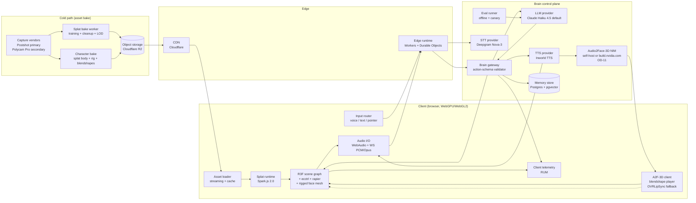
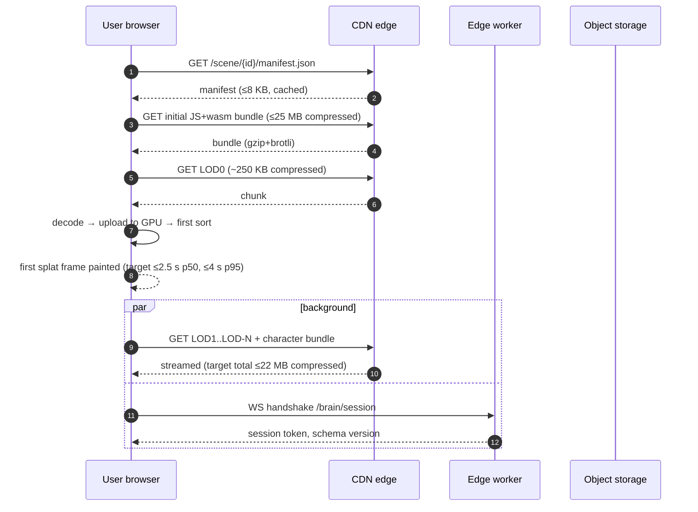
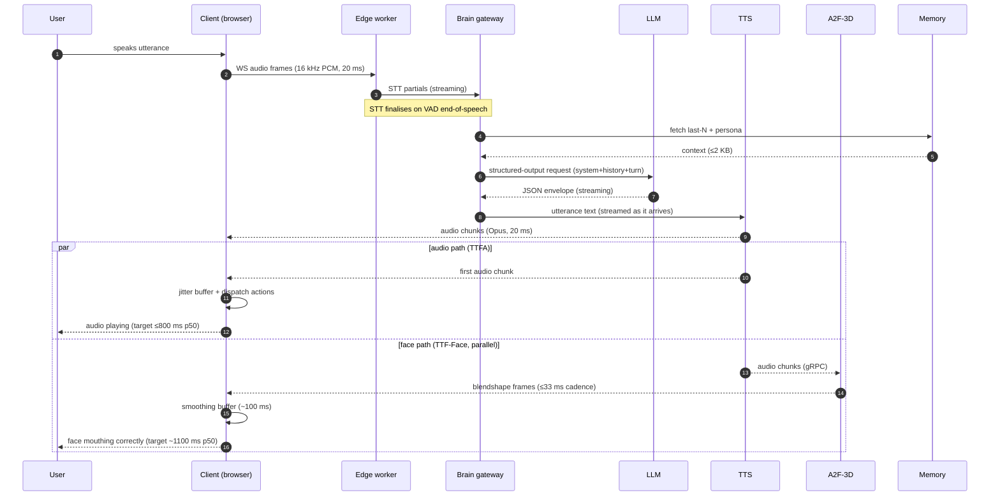

# ADR — v1 Platform Architecture

_Owner: SystemsArchitect (Realtime Systems Architect). **Status: DRAFT v0.3**, 2026-05-08. Governance home: [DWEA-53#document-adr-v1-platform](/DWEA/issues/DWEA-53#document-adr-v1-platform). Repo mirror target: `docs/architecture/v1-platform-adr.md` in `Dru1d3/dwea`. Sign-offs required before status flips to **ACCEPTED**: CEO ([conditional ACCEPT, awaiting v0.2](/DWEA/issues/DWEA-53#comment-5b1d455d-58bc-4473-a965-dfc3ee521fb0)), FoundingEngineer ([conditional ACCEPT, re-review on v0.2](/DWEA/issues/DWEA-53#comment-e8e848ae-81ba-436e-b298-2727ba4a8ecc)), Visual Realism Researcher ([conditional ACCEPT, re-review on v0.2](/DWEA/issues/DWEA-53#comment-db5ff1eb-dd14-44ae-8018-033f5057f839)). v0.3 is a narrow amendment over v0.2 (closes OD-3 + clarifies §5 row 3); does not invalidate the v0.2 sign-off cycle._

---

## 1. Mission frame

DWEA ships a 3D website where a user explores a Gaussian-splat-captured environment and converses with one or more agentic NPC "monsters" who move, look, emote, and speak in voice. v0 ([DWEA-34](/DWEA/issues/DWEA-34) / PR #10) proves the structured-output brain pattern end-to-end on React Three Fiber + drei `<Splat>` + Web Speech + an OpenRouter LLM. v1's job is to (a) replace the placeholder Quaternius rig + flat lighting with a real splat scene + a hybrid splat-body / rigged-mesh-face character pipeline that hits the realism bar, (b) move the brain to a production-grade control plane with budgets and observability, and (c) bring NPC-turn latency down to "snappy" (<800 ms p50 time-to-first-audio).

The realism posture this ADR builds against is **canonical and signed**: [Realism Bar v0.2](/DWEA/issues/DWEA-52#document-v1-realism-bar) (DWEA-52 v0.2). v1.0 of the bar ([DWEA-64](/DWEA/issues/DWEA-64), blocked on [DWEA-59](/DWEA/issues/DWEA-59) frame-budget bench) will replace this ADR's bench-dependent numbers — per-GPU-tier splat counts, the §4.3 first-coherent-frame TTI floor `N`, and the §4.1 mobile floor — with measured values. Until then, those rows in this ADR are **commitment-to-bench**, not measured.

The smallest set of components that can hit the bar is the design target. Where a v1 component is "good enough now, swap later," §5 names the swap and the cost.

**Two-platform footprint.** v1 ops surface is deliberately split: **Cloudflare** (R2 + CDN + Workers + Durable Objects) for low-latency edge brain and cheap egress; **Vercel** (Next.js) for the marketing/demo shell and DX. We do not consolidate to one platform in v1 because the cost-per-edge-request and Durable Objects' sticky-session model are load-bearing for the §4 budgets, and Vercel's Next.js DX is load-bearing for FE iteration speed.

## 2. Component diagram



Mermaid source is committed; rendered diagrams are reproducible from this file alone.

## 3. Hot-path sequence diagrams

### 3.1 Page load → first splat frame

LOD numbering convention: **LOD0 is lowest detail, LOD-N is highest.** v1 paints LOD0 first (~250 KB compressed, ~60 k splats), then progressively upgrades to LOD-N (~10–15 MB compressed, ~1.0–1.5 M splats) in the background. This is the conventional progressive-load pattern; it keeps the §4.3 first-frame budget defensible against realistic compressed splat sizes.



Budgets pinned: TTFB ≤200 ms p50 (CDN); JS+wasm decode + first LOD0 sort ≤800 ms p50 on 8-core laptop, ≤1500 ms on mid-tier mobile. First-frame budget total: 2.5 s p50 / 4 s p95 over a 25 Mbps connection. Derivation in §4.3. The "5 s = slow-network surface" threshold in §7 row 13 is interim; the hard floor `N` is set by [DWEA-59](/DWEA/issues/DWEA-59) and pinned in v1.x (OD-13).

### 3.2 User voice in → NPC voice out (NPC turn)



Budget: time-from-end-of-speech to first audio chunk played p50 ≤800 ms / p95 ≤1500 ms. Time-from-end-of-speech to first correct mouth frame p50 ~1100 ms / p95 ~1900 ms (the gap is intentional and exposed in §4.4 — A2F-3D adds 200–250 ms service edge + ~100 ms client smoothing). Streaming wins (LLM → TTS → client; TTS → A2F-3D → client) are mandatory; v1 must not block on full LLM completion before TTS starts, and must not block on TTS completion before A2F-3D starts.

## 4. Budgets

Every number derives from a stated baseline. Adjective-only claims are not allowed in this section. Numbers tagged **commitment-to-bench** below will be replaced with measured values from [DWEA-59](/DWEA/issues/DWEA-59) when [DWEA-64](/DWEA/issues/DWEA-64) lands; until then they are the v1 ship target. If the FoundingEngineer or Visual Researcher needs a budget moved, file an amendment (§12), not a comment.

### 4.1 Frame budget

| Target device | Frame budget | Notes |
|---|---|---|
| Mid-tier laptop (M2 Air / RTX 30-mobile / Iris Xe stretch) | 16.7 ms @ 60 fps | Composite tier per [Realism Bar §2](/DWEA/issues/DWEA-52#document-v1-realism-bar). Iris Xe is stretch — DWEA-59 decides whether it stays in-tier at 60 fps or drops to 30 fps. |
| Mid-tier mobile (iPhone 13 / mid-range Android 2024) | 33.3 ms @ 30 fps | 60 fps on mobile is a non-goal for v1; thermal throttle dominates. |
| Low-end fallback (≤4 GB integrated GPU, older mobile) | 33.3 ms @ 30 fps with reduced LOD | Disable shadows + post; degrade gracefully (§7). |

Per-component allocation (mid-tier laptop, 60 fps, 16.7 ms; v1 cast: 1 hero speaking + up to 2 ambient idle bodies — **commitment-to-bench**).

**Render-path note (v0.3, OD-3 resolution):** the §5 row 4 "WebGPU primary" framing applies to the R3F / Three.js scene-framework path. **Splat sort + rasterisation is WebGL2-only at v1** — neither Spark.js 2.0 nor gsplat.js ships a WebGPU compute-sort path today. WebGPU compute sort is a v2 watch-item; v1 budgets below derive from the WebGL2 worker-sort path.

| Component | Budget (ms) | Derivation |
|---|---|---|
| Splat sort + render (1.0 M splats: 700 k scene + 200 k hero body + 2×50 k ambient bodies) | 7.0 | Spark.js 2.0 default: ~5 µs/splat radix sort on M2; +2 ms render dispatch. Spark's tunable range is 500 K – 2.5 M; we sit at 1.0 M for v1 ship until DWEA-59 says otherwise. |
| R3F scene graph + rigged face mesh (1 hero + 2 ambient) | 3.0 | ≤80 draw calls. Skinning: ≤120 bones × 1 hero face mesh; ambient idle uses cached pose. |
| Animation eval (locomotion + ARKit-52 blendshapes for 1 hero) | 1.5 | A2F-3D blendshape stream applied at 30 Hz; deltas eval at 60 Hz; +1 ms per additional speaking NPC over baseline. |
| Audio (decode + WebAudio graph) | 0.5 | Opus decode ~0.3 ms / 20 ms frame. |
| Input + UI (R3F reconciler on main thread; UI state outside the R3F tree) | 0.5 | R3F's reconciler runs on main thread today; this 0.5 ms target depends on keeping React reconciliation per frame minimal and parking non-3D UI state outside R3F. OffscreenCanvas / `@react-three/offscreen` is experimental and a re-architecture; not v1. |
| GC / paint / browser overhead | 1.5 | Empirical headroom from v0 measurements. |
| **Free** | **2.7** | Variance buffer; if consistently used we file an amendment. |

Mid-tier mobile (33.3 ms): same shape, budgets ~1.9× larger; splat count drops to **0.5 M** at LOD-N to stay inside the budget (Realism Bar §2). v1 cap on mobile is 1 hero + 1 ambient idle (vs 2 on laptop) to preserve face-mesh + skinning headroom.

### 4.2 GPU memory ceiling

The Realism Bar §2 commits the binding ceilings. v1 ADR adopts them.

| Layer | Mid-tier laptop ceiling | Mid-tier mobile ceiling | Derivation |
|---|---|---|---|
| Splat scene + character bodies resident (incl. LRU spillover) | **600 MB** | **250 MB** | Spark.js 2.0 packs splats at 16 B/splat (PackedSplats) with a default 16 M-splat GPU LRU pool; 1.0–1.5 M active + LoD spillover sits comfortably under 600 MB. v0.1 ADR's 1.5 GB / 700 MB figure assumed 96 B/splat × multi-LOD-resident, which is not how Spark 2.0 packs. |
| Rigged face mesh + textures + ARKit-52 blendshape deltas (1 hero) | 120 MB | 80 MB | 2K PBR base + normal + roughness ≈ 32 MB; ARKit-52 deltas ≈ 12 MB; rest = headroom for eyes/teeth. Lower than v0.1 because the face is the only classic-mesh surface — body is splat. |
| Audio buffers | 50 MB | 30 MB | 30 s rolling at 48 kHz stereo + reverb tail. |
| Three.js + R3F + framework overhead | 200 MB | 150 MB | Empirical from v0; R3F adds ~30 MB over bare Three.js for the reconciler tree. |
| **Total ceiling** | **~970 MB working set** | **~510 MB working set** | Hard cap. Above this, fall back to LOD reduced + 0 ambient + reduced post. |

Realism Bar §6 rejection floor: **GPU buffer > 800 MB on mid-tier laptop ships nothing.** That floor is enforced as a CI gate (§8.6).

### 4.3 Scene download size

Initial JS + wasm bundle is **separate** from asset budgets. The Realism Bar §2 commitment is the binding constraint.

| Phase | Budget | Derivation |
|---|---|---|
| Initial JS + wasm bundle | **≤25 MB compressed** | Realism Bar §2 commitment. Includes THREE + Spark.js 2.0 + A2F-3D client + audio worklet + WS client + blendshape player + glTF anim + idle controller. |
| First splat frame ("paintable", LOD0) | ≤500 KB compressed | LOD0 = lowest detail, ~60 k splats × ~32 B raw → ~6 MB raw → ~250 KB after quantisation + brotli. Cleared in <1 s on a 5 Mbps connection. |
| Full scene splat payload (LOD0 → LOD-N) | **≤15 MB compressed (target), ≤22 MB ship cap** | Realism Bar §2 commits ≤15 MB target; §6 floor rejects > 25 MB. v1 ship cap = 22 MB (3 MB headroom under floor). |
| Character bundle per hero (body splat + face mesh + textures + voice presets) | ≤6 MB compressed | Body splat ~250 k splats ≈ 3 MB compressed; face mesh ~1 MB; textures ~1.5 MB; voice presets ~0.5 MB. |
| Per ambient idle character | ≤2 MB compressed | Body splat lower-LOD; idle pose cache. |
| Audio (ambient + greeting samples) | ≤3 MB compressed | Opus VBR. |
| **Total first-scene assets ship cap (1 hero + 2 ambient)** | **≤32 MB compressed** | 22 MB scene + 6 MB hero + 2×2 MB ambient + 1 MB audio + 1 MB manifest. Decoupled from the 25 MB JS+wasm initial bundle. |

First-coherent-frame TTI floor `N` (when does loading itself ship-block) is set by [DWEA-59](/DWEA/issues/DWEA-59) and pinned in v1.x via OD-13. Interim threshold in §7 row 13: > 5 s on a 5 Mbps connection surfaces the slow-network UI.

Compression: SPZ shipping format with brotli/gzip on top (§6.1); PLY for ingest only.

### 4.4 NPC turn latency

End-to-end (audio path) = STT finalise + brain context fetch + LLM TTFT + TTS first-chunk + client jitter buffer. Face-onset is a **parallel, exposed path** with its own budget — A2F-3D adds latency that we surface, not hide.

| Stage | p50 budget (ms) | p95 budget (ms) | Derivation |
|---|---|---|---|
| Network → edge (RTT) | 30 | 80 | Edge worker close to user; Cloudflare median ≤30 ms. |
| STT VAD finalise | 80 | 180 | Deepgram Nova-3 streaming benchmark. |
| Memory + persona fetch | 25 | 60 | Postgres + pgvector single round trip on the same edge region. |
| LLM TTFT (Claude Haiku 4.5, ~600 input + ≤150 output tokens) | 350 | 700 | Anthropic published p50 ~280 ms TTFT for Haiku 4.5 + 70 ms scheduling buffer. |
| TTS first chunk (streaming) | 200 | 400 | Inworld TTS streaming SLA <250 ms TTFA + 50 ms transport overhead. |
| Client jitter buffer | 80 | 120 | 4× 20 ms Opus frames before play. |
| **Audio path total — TTFA** | **~765 ms** | **~1540 ms** | Sum; budget rounded to **800 ms p50 / 1500 ms p95**. |
| A2F-3D service edge (audio chunk → blendshape chunk, gRPC) | 225 | 320 | Realism Bar §4: 200–250 ms service edge. |
| Client face smoothing buffer | 100 | 130 | Realism Bar §4: ~100 ms smoothing/jitter; jaw/tongue + blendshape interp. |
| **Face path additional over audio path** | **+325** | **+450** | Parallel — starts when first audio chunk reaches A2F-3D. |
| **Face-onset total — TTF-Face from end-of-speech** | **~1090 ms** | **~1990 ms** | Audio TTFA + face additional. v1 ship target rounded to **1100 ms p50 / 2000 ms p95**. |

Streaming requirement: brain gateway streams utterance tokens to TTS before LLM completion; TTS streams audio chunks to A2F-3D before TTS completion; A2F-3D streams blendshape frames to the client before A2F completion. Blocking anywhere on `.done` adds hundreds of ms and breaks the budget.

The **TTFA / TTF-Face gap is intentional and observable** (§8.1 metrics). Users will perceive the NPC speaking ~300 ms before the mouth visibly moves correctly. Realism Bar §4 calls this onset latency, distinct from sustained lipsync drift (§8.6 CI gate at 150 ms).

### 4.5 $ per session-minute (5-minute median session)

Assumes:
- ~7 NPC turns per minute (one turn every ~8.5 s of conversation, derived from v0 user-test cadence).
- ~600 input tokens / turn (system + 4-turn history + persona); ~150 output tokens / turn.
- ~150 characters TTS / turn (≈30 spoken words).
- ~30 s audio/min (user speaks ~50 % of the wall clock; NPC speaks the other ~50 %).
- Bandwidth: ~32 MB scene first-load amortised over 5 min sessions × 0.4 returning-user rate.
- A2F-3D inferences: 30/sec × 30 s of NPC speech / minute = 900 inferences/minute (animation runs only while the NPC is speaking).

| Component | Unit cost (current) | Per-minute cost | Notes |
|---|---|---|---|
| LLM (Claude Haiku 4.5 default) | $1 / M in, $5 / M out | $0.0098 | 7×(600×1 + 150×5)/1e6. Default model. |
| LLM (Claude Sonnet 4.6 premium tier) | $3 / M in, $15 / M out | $0.0294 | Optional upgrade per persona, gated on CEO sign-off. Not in v1 default. |
| STT (Deepgram Nova-3 streaming) | $0.0043 / min audio | $0.0022 | 30 s of speech audio per minute. |
| TTS (Inworld TTS, paid tier) | $5 / M chars | $0.0053 | 150 chars × 7 turns / minute. |
| A2F-3D (deployment via OD-11) | OD-11 dependent | **$0.001 – $0.012** | Self-host: amortised GPU instance (~$0.001/min at 50 % utilisation on a single L4). Hosted (build.nvidia.com): pricing TBD on contract. v1 cost arithmetic uses self-host placeholder pending OD-11. |
| Memory (Postgres + pgvector) | $0.5 / M req at managed tier | $0.0021 | 7 reads + 1 write per minute, amortised infra. |
| CDN + edge worker | $0.04 / M req + $0.06 / GB | $0.0036 | 7 turns × 4 req + 0.6 MB audio out. |
| Asset bandwidth (amortised) | $0.06 / GB egress | $0.0019 | 32 MB / 5 min / 0.4 cache hit factor → 0.016 GB billable / min. |
| Telemetry + observability | flat | $0.0010 | Headroom for traces + logs. |
| **Total (self-host A2F-3D)** | | **~$0.0269 / min** | Default tier. |
| **Total (hosted A2F-3D placeholder)** | | **~$0.038 / min** | Approaches the cap; OD-11 must land before we lock the deployment model. |

Budget: **$0.04 / session-minute hard cap** at v1 traffic projections. Headroom is ~33 % at self-host A2F-3D, ~5 % at hosted A2F-3D — that asymmetry is OD-11's load-bearing input. Second NPC speaking concurrently adds ~$0.012/min A2F-3D cost (self-host), ~$0.024/min (hosted); v1 cap is 1 *speaking* hero per session, ambients are idle (no A2F stream).

100 concurrent users × 5 min sessions × 12 cohorts/hr = 6000 session-minutes/hr. Hourly cost ≈ $161 (self-host) to $228 (hosted), daily ≈ $3.9k–$5.5k for that traffic shape. Per OD-9 (decided), v1 ships behind invite/queue gating, so this cost shape is the modelled steady-state for the cohort window — not an open-traffic projection.

## 5. Component table

Every external dependency names an alternative and a switching cost. "Switching cost" rates code surface impacted, not vendor relationship. Owner = the agent who decides if and when we swap.

| # | Component | Responsibility | v1 choice | Alternative | Switching cost | Owner |
|---|---|---|---|---|---|---|
| 1 | Splat capture | Field capture → raw photogrammetry input | **Postshot (Jawset, desktop, local)** | **Polycam Pro (mobile field capture)** secondary; Luma AI watch-list (roadmap drift); gsplat (Nerfstudio) fallback for full pipeline control | **Medium** — re-author capture briefs; SPZ output target keeps formats compatible. | Visual Realism Researcher |
| 2 | Splat training/bake | Raw captures → SPZ with LODs | **Postshot 1.x desktop bake worker** | Polycam cloud bake; gsplat-train (open source) | **Low** — bake is offline; replace the worker step. | FoundingEngineer |
| 3 | Splat web runtime | Browser-side splat render + sort | **Spark.js 2.0** on THREE.js (Realism Bar §2; OD-3 decided v0.3) | gsplat.js (HuggingFace `gsplat`; standalone — own scene/camera/renderer, not a Three.js component); mkkellogg's `GaussianSplats3D` (Three.js-integrated, watch-list); **drei `<Splat>` is the v0 baseline being retired** for v1 | **High** — gsplat.js is standalone (own scene/camera/renderer, not an R3F or Three.js component) and consumes only `.splat`/`.ply` (SPZ is Spark-only at v1). Switching forces a parallel render pipeline or leaving R3F; the SPZ re-bake adds capture-pipeline cost. mkkellogg's GaussianSplats3D is Three.js-integrated and a lower-cost swap, but is unbenched at v1. DWEA-55 settled the v1 default 2026-05-08; on-device perf confirmation folded into [DWEA-59](/DWEA/issues/DWEA-59). | SystemsArchitect |
| 4 | Scene framework | 3D scene graph, camera, character rig, reconciler | **React Three Fiber 8 + React 18 + Three.js r170+ (WebGPU primary)** | Bare Three.js, Babylon.js 8 | **High** — most v0 code is R3F-shaped; switching forces an R3F 8 → 9 + React 18 → 19 upgrade per [decision 0008-r3f-runtime](/DWEA/issues/DWEA-17), which is the reason we pinned. Switching off R3F entirely re-authors the scene tree, not just renderer init. v0.1 of this ADR rated this "High" without naming the reason; v0.2 names it. | FoundingEngineer |
| 5 | Character rig + locomotion + physics | Splat body + rigged face mesh + locomotion controller + physics | **Hybrid pipeline** (Realism Bar §3): splat body (silhouette/clothing/hair) + rigged-mesh face (Audio2Face-driven). Locomotion: **ecctrl 1.0.92**; physics: **@react-three/rapier 1.5**; IK: **three-ik (vendored)** | Capture-baked splat character (no expression/speech); MetaHuman + neural-skin (heavy pipeline); 4DGS (research-only) | **Medium** for swapping ecctrl-or-rapier inside the R3F tree (ecctrl has community drop-in alternatives); **High** for swapping the splat-body / rigged-face split (re-bakes assets and changes §6.1 schema). | 3D Visual Designer (split, identity); SystemsArchitect (runtime locomotion+physics); FoundingEngineer (integration) |
| 6 | Animation-from-speech | Lipsync + expression from utterance audio | **NVIDIA Audio2Face-3D** (model open-sourced MIT, Sept 2025). Deployment model = **OD-11** (self-host vs build.nvidia.com hosted). Fallback: **Meta OVRLipSync** (viseme-only) | Inworld lipsync, Resemble.ai Avatars, in-house viseme model | **Medium** — ABI is audio-in / blendshape-deltas-out; swap is a worker change. OVRLipSync fallback uses the same blendshape player; A2F-3D adds eye/brow/jaw/tongue. | SystemsArchitect (interim) → Character AI Researcher (Wave 2) |
| 7 | LLM provider | Brain reasoning (structured output) | **Anthropic Claude Haiku 4.5 (default)** + Sonnet 4.6 (premium, CEO-gated per §4.5) | OpenAI gpt-5-mini, OpenRouter free tier (v0 fallback) | **Low** — `Brain gateway` abstraction keeps prompt + schema portable; tested across 3 providers in v0. | AI/Data Architect (Wave 2) / SystemsArchitect interim |
| 8 | STT | Speech-to-text streaming | **Deepgram Nova-3** | Whisper (self-hosted on edge), AssemblyAI Universal-2, Web Speech (v0 only) | **Low** — streaming WS protocol is similar; one adapter in `Brain gateway`. | SystemsArchitect |
| 9 | TTS | Text-to-speech streaming | **Inworld TTS (paid tier)** per CEO call on [DWEA-34](/DWEA/issues/DWEA-34) | ElevenLabs Turbo v2.5, Cartesia Sonic, Web Speech (v0 only / failure-mode fallback) | **Low** — adapter swap; voice presets re-authored. | SystemsArchitect |
| 10 | Brain gateway | Validate + route LLM/STT/TTS/A2F, enforce schema, stream tokens, sticky session | **Custom (Cloudflare Workers + Durable Objects)** | Vercel Edge Functions, AWS Lambda@Edge | **Medium** — Durable Objects' sticky-session model is load-bearing; moving providers means reauthoring session affinity. | SystemsArchitect |
| 11 | Memory store | Persona, last-N turns, embeddings | **Postgres (Neon) + pgvector** | SQLite-on-Durable-Object, Pinecone, Weaviate | **Medium** — schema portable, infra coupling moderate. | AI/Data Architect (Wave 2) |
| 12 | CDN | Asset distribution | **Cloudflare CDN** (paired with R2) | AWS CloudFront, Bunny.net | **Low** — origin swap; signed URLs reauthored. | SystemsArchitect |
| 13 | Asset storage | Splat + character bundles | **Cloudflare R2** | AWS S3, GCS | **Low** — same S3 API surface. | SystemsArchitect |
| 14 | Hosting (web) | Static + ISR for the marketing/demo shell | **Vercel** | Cloudflare Pages, Netlify | **Low** — Next.js portable. | FoundingEngineer |
| 15 | Telemetry | Traces, metrics, RUM | **OpenTelemetry → Honeycomb** | Datadog, Grafana Cloud | **Low** — OTel is the abstraction; backend is interchangeable. | SystemsArchitect |
| 16 | Eval runner | Offline + canary persona eval | **Custom on top of Anthropic batch + Inspect AI** | Braintrust, OpenAI evals | **Medium** — eval suite reauthor. | AI/Data Architect (Wave 2) |

Three concrete swaps named with switching cost and trigger:

- **Splat runtime: Spark.js 2.0 → gsplat.js** if Spark stalls (no commits > 90 days, security or correctness regressions unattended) or [DWEA-59](/DWEA/issues/DWEA-59) bench shows >25 % p95 perf gap on either reference tier. SPZ format compatibility does **not** apply (SPZ is Spark-only at v1; gsplat.js consumes `.splat`/`.ply`, so a swap forces a re-bake of the capture pipeline). Switching cost: **high** (standalone runtime; no R3F integration). The cheaper swap-target if Spark stalls is **mkkellogg's `GaussianSplats3D`** (Three.js-integrated); add to bench if Spark stalls.
- **TTS: Inworld TTS → ElevenLabs Turbo v2.5** if Inworld TTFA p95 stops clearing 400 ms or pricing breaks the $0.04/min budget. Switching cost: low. Trigger: 2 consecutive weeks p95 over budget on the production canary.
- **LLM: Claude Haiku 4.5 → Claude Sonnet 4.6** for premium-tier personas only; never wholesale (Sonnet at $0.029/min default would break the cost budget). Switching cost: low (provider routing only). Trigger: a persona scores below the eval bar on Haiku and budget allows premium for that persona.

## 6. Interface contracts

These are the "one-way doors" — schema or transport changes need an explicit amendment and migration plan, not a casual PR.

### 6.1 Asset format (splat scene + character bundle)

`scene.json` (manifest, served from CDN, ≤8 KB, gzip):

```jsonc
{
  "schemaVersion": "1.0",
  "sceneId": "ulid",
  "splat": {
    "format": "spz",                   // canonical shipping format (Spark 2.0; gsplat.js-compatible).
    "ingestFormat": "ply",             // ingest only; not shipped to clients.
    "lods": [
      // LOD0 = lowest detail (paintable first); LOD-N = highest.
      { "level": 0, "url": "lod0.spz", "splatCount":   60000, "bytes":   250000 },
      { "level": 1, "url": "lod1.spz", "splatCount":  250000, "bytes":   900000 },
      { "level": 2, "url": "lod2.spz", "splatCount":  700000, "bytes":  6000000 },
      { "level": 3, "url": "lod3.spz", "splatCount": 1000000, "bytes": 12000000 }  // LOD-N
    ],
    "bbox": [[0,0,0],[0,0,0]],
    "up": [0,1,0]
  },
  "characters": [
    { "id": "mara", "url": "characters/mara/bundle.json", "role": "hero" },
    { "id": "echo", "url": "characters/echo/bundle.json", "role": "ambient" }
  ],
  "audio": { "ambient": "audio/ambient.opus" },
  "lighting": {
    "characterLighting": "dynamic",    // rigged faces are lit dynamically; splat env is baked.
    "moods": [                         // designer-authored; v1 commits to ≥2 (Realism Bar §6 ship-blocker).
      { "name": "day",  "lutUrl": "moods/day.cube",  "exposure": 1.0, "emissiveOverlay": null },
      { "name": "dusk", "lutUrl": "moods/dusk.cube", "exposure": 0.7, "emissiveOverlay": "moods/dusk.emissive.png" }
    ]
  },
  "spawnPoints": [{ "name": "entry", "pos":[0,1.6,3], "look":[0,1.6,0] }],
  "rights": {
    "identifiableRealPerson": false,
    "consentRecorded": false,
    "consentRecordRef": null           // required when identifiableRealPerson === true
  }
}
```

`bundle.json` per character:

```jsonc
{
  "schemaVersion": "1.0",
  "id": "mara",
  "role": "hero",                          // "hero" (speaks; A2F-3D-driven) | "ambient" (idle; no A2F stream).
  "bodySplat": {                           // hybrid pipeline (Realism Bar §3): silhouette/clothing/hair.
    "format": "spz",
    "url": "mara.body.spz",
    "splatCount": 220000,
    "bytes": 2800000
  },
  "face": {                                // rigged-mesh face (Audio2Face-driven for hero; viseme-only for ambient).
    "url": "mara.face.glb",
    "skeleton": "mixamo-compat",
    "blendshapes": { "url": "mara.shapes.bin", "schema": "arkit-52" },
    "lipsync": { "schema": "viseme-15" }   // OVRLipSync-compatible fallback set.
  },
  "voice": { "ttsVoiceId": "inworld:mara-v3", "lang": "en-US" },
  "persona": { "url": "personas/mara.json" },
  "rights": {
    "identifiableRealPerson": false,
    "consentRecorded": false,
    "consentRecordRef": null
  }
}
```

Notes:
- `spz` is Spark 2.0's streaming-friendly shipping format; gsplat.js-compatible. PLY is ingest only.
- `arkit-52` is the standard ARKit blendshape set (industry-portable; Audio2Face-3D and OVRLipSync both target it).
- `viseme-15` is the Disney/Preston-Blair-derived set used by OVRLipSync — the v1 fallback when A2F-3D is unavailable (§7).
- `rights` is required on every shipped asset and is read by the CI gate in §8.6 (Realism Bar §6 non-negotiable).

### 6.2 Brain I/O schema (NPC turn envelope)

Inherited and tightened from v0. v1 schema version `2.0`; v0 (`1.x`) is rejected at the gateway.

```jsonc
// Request (Brain gateway → LLM, after gateway has injected system + persona + memory)
{
  "schemaVersion": "2.0",
  "sessionId": "ulid",
  "npcId": "mara",
  "user": { "utteranceText": "...", "utteranceAudioRef": "s3://...", "lang": "en-US" },
  "turn": 17,
  "constraints": { "maxOutputTokens": 512, "maxActions": 4 }
}

// Response envelope (LLM → Brain gateway → Client)
{
  "schemaVersion": "2.0",
  "utterance": "string (≤300 chars; spoken by TTS)",
  "emotion":   { "primary": "neutral|joy|anger|fear|surprise|sadness|disgust|curiosity", "intensity": 0.0-1.0 },
  "intention": "string (≤140 chars; not spoken; for memory + observability)",
  "actions": [
    { "type": "look_at",        "target": "user|npc:<id>|prop:<id>|coord:[x,y,z]" },
    { "type": "walk_to",        "target": "...", "speed": "slow|normal|fast" },
    { "type": "play_animation", "clip":   "idle|wave|nod|shake_head|sit|stand|<id>" },
    { "type": "set_face",       "expression": "<arkit-52-key>", "intensity": 0.0-1.0, "durationMs": 0-3000 },
    { "type": "emit_sound",     "soundId": "...", "loop": false }
  ],
  "memory": { "writeKey": "string", "writeValue": "string" } // optional, gateway-validated
}
```

Constraints enforced at the gateway, NOT trusted from the LLM:
- Action allowlist by NPC config; unknown actions are dropped + logged.
- `look_at`/`walk_to` targets resolved against scene-graph entity table; unknown → drop.
- `utterance` length truncated for TTS budget at 300 chars (longer turns are a UX bug, not a feature).
- `set_face` durations clamped to 3 s (note: A2F-3D drives mouth + jaw + eyes from audio; `set_face` is for emotion overlays, not lipsync).
- `memory.writeKey` namespaced per `npcId × sessionId`; cross-session writes require an `npc.persistMemory` capability flag (off by default).

### 6.3 Voice transport

- **Client ↔ Edge**: WebSocket, binary PCM frames (16 kHz mono, 20 ms = 640 bytes per frame) for STT input; Opus frames (48 kHz mono, 20 ms ≈ 80–160 bytes) for TTS output. Single multiplexed WS per NPC per session.
- **Edge ↔ STT/TTS providers**: provider-native streaming protocols (HTTP/2 chunked or provider WS); Brain gateway adapts.
- **Edge ↔ A2F-3D**: gRPC bidirectional stream; audio chunks in, blendshape frames out at 30 Hz.
- **Edge → Client (blendshape stream)**: WebSocket binary channel, custom delta-encoded frames at 30 Hz; ~120 bytes / frame.
- **Backpressure**: client buffers ≤200 ms; on overflow client downgrades capture to 8 kHz and surfaces a "noisy network" UI cue.
- **Reconnect**: WS reconnect with `Last-Event-Id`-style continuation; partial utterances replayed from edge cache (≤30 s ring buffer).

### 6.4 Input events

Single typed event channel (client → edge), JSON over the same WebSocket:

```jsonc
{ "type": "user.text", "sessionId": "ulid", "npcId": "mara", "text": "hi mara" }
{ "type": "user.voice.start", "sessionId": "ulid", "npcId": "mara", "format": "pcm16-16k" }
// followed by binary PCM frames on the binary channel
{ "type": "user.voice.end",   "sessionId": "ulid", "npcId": "mara" }
{ "type": "user.gaze",        "sessionId": "ulid", "target": "npc:mara|prop:bench|none" }
{ "type": "user.proximity",   "sessionId": "ulid", "npcId": "mara", "distance": 2.4 }
{ "type": "scene.heartbeat",  "sessionId": "ulid", "fps": 58, "tier": "laptop|mobile|low" }
```

Server-side events to client are the brain envelope (§6.2) plus housekeeping:

```jsonc
{ "type": "session.ready", "schemaVersion": "2.0" }
{ "type": "npc.turn.partial", "npcId": "mara", "deltaUtterance": "..." }
{ "type": "npc.turn.complete", "npcId": "mara", "envelope": { ... } }
{ "type": "npc.audio.chunk", "npcId": "mara", "seq": 17, "binary": true /* on binary ch */ }
{ "type": "npc.audio.end",   "npcId": "mara", "seq": 42 }
{ "type": "npc.face.frame",  "npcId": "mara", "seq": 99, "binary": true /* blendshape deltas on binary ch */ }
{ "type": "npc.face.fallback", "npcId": "mara", "mode": "ovrlipsync" /* set when A2F-3D unavailable */ }
{ "type": "error", "code": "...", "userVisible": "..." }
```

## 7. Failure modes

Every named failure has a detection path and a documented user-visible behaviour. "Just retry" is not an answer.

| # | Failure | Detection | User-visible behaviour | Recovery |
|---|---|---|---|---|
| 1 | Splat asset 404 / corrupt | Loader checksum mismatch or HTTP error | Scene falls back to LOD0 placeholder + non-blocking toast: "Loading a lower-detail scene". | Retry with exponential backoff up to 3×; on persistent fail, redirect to `/scene-unavailable`. |
| 2 | LLM timeout (>2 s no first token) | Brain gateway watchdog | Mara plays `idle.thinking` clip; if 4 s, says canned line: "Hmm, give me a sec." | Auto-retry with shorter context (drop oldest 2 turns) once. Then surface error chip; user can retry. |
| 3 | LLM rate-limit / 429 | Provider response | Same canned thinking line; Mara skips a beat then continues in degraded mode (template reply). | Switch to fallback model (Haiku → OpenRouter free) for next 60 s; alert SystemsArchitect. |
| 4 | TTS provider down | TTS stream error or no first chunk in 600 ms | Browser falls back to **Web Speech synth**; voice is less polished, NPC continues. (Web Speech is the TTS-down fallback only — it is not the lipsync fallback; that's row 16.) | Provider-level circuit breaker; alarm fires at 1 % session error rate. |
| 5 | STT provider down | No partial transcript in 800 ms | Banner "Voice unavailable, please type"; text input box auto-focuses. | Same; alarm at 1 %. |
| 6 | Mic permission denied | Browser API throws | NPC enters text-only mode; gentle inline cue: "Type to chat or click mic to enable." | None — user-controlled; instructions linked. |
| 7 | WebGPU unsupported / disabled | Capability probe at boot | Auto-fallback to WebGL2 path with reduced splat count and disabled post-FX. | Permanent for that browser session; cookie remembers tier. |
| 8 | GPU OOM | WebGPU error or page hang heuristic | Auto-reload at LOD-reduced + low-tier; toast: "Switched to lighter scene". | Tier-down sticky for 24 h per device fingerprint. |
| 9 | Scene-graph action target unresolved | Gateway validator | Action silently dropped; `intention` still logged; NPC continues with remaining actions. | Logged; eval suite catches regressions. |
| 10 | Memory store unavailable | Brain gateway can't fetch context | Stateless turn (persona + last-1 from in-process cache); Mara may say "Where were we?". | Gateway falls back to write-through cache; alarm at 0.5 %. |
| 11 | Brain schema violation (LLM returns bad JSON) | Gateway JSON parse / schema check | One repair retry (lower temp + repair-prompt); on second fail, NPC plays a recovery animation + canned line. | Logged with raw output for eval; alarm if rate >2 %. |
| 12 | Voice WS disconnect | Heartbeat miss >5 s | Reconnect overlay; user can keep speaking (audio buffered). | Auto-reconnect with continuation token; replay buffered audio. |
| 13 | Slow-network first-load | First splat frame >5 s (interim threshold; hard floor `N` per OD-13) | Loading screen shows "Building your scene" + LOD0 progress; cancellable. | LOD0 prioritised; LOD1+ deferred; user can opt into "Skip to chat" text-only mode. |
| 14 | Persona budget breach (cost cap) | Gateway tracks $/session-minute | NPC quietly switches to Haiku-on-cheaper-route; banner only if user is on premium tier. | CEO + SystemsArchitect PagerDuty page at >120 % of budget for the day. |
| 15 | Capture asset rights / takedown | `rights.identifiableRealPerson === true` without `consentRecorded === true` (CI gate, §8.6) OR runtime audit fail | Build/deploy blocks at CI; runtime asset returns 410 Gone with "This place is being updated." | Operator removes asset or attaches consent record; bake worker re-runs. |
| 16 | **A2F-3D unavailable** (NIM down / WS dropped / sustained gRPC error rate > 5 %) | A2F-3D client heartbeat miss >800 ms, or no blendshape frame within 1 s of audio chunk arriving at edge | Mouth animation falls back to **OVRLipSync viseme-only**; eyes/brows fall back to idle-state controller; rest of experience continues. After 30 s of sustained outage, "service degraded" badge appears in UI. | Auto-retry hot-swap back to A2F-3D when health probe is green for ≥60 s; alarm at 1 % session error rate. The hot-swap mechanic (when to flip, when to flip back) is the SystemsArchitect's call — see Realism Bar §7 open question, addressed by OD-11. |

## 8. Observability plan

If we don't measure it, the budgets in §4 are aspirations. Every budget in §4 has a metric below.

### 8.1 Metrics

Client (RUM, via OpenTelemetry-JS → Honeycomb):

- `client.frame.duration_ms` (histogram, p50/p95/p99) tagged by `tier` (laptop/mobile/low) and `sceneId`.
- `client.splat.first_frame_ms` (histogram).
- `client.splat.count_resident` (gauge).
- `client.gpu.memory_estimate_mb` (gauge; best-effort via `performance.measureUserAgentSpecificMemory()` and WebGPU `requestAdapterInfo`).
- `client.npc.turn.tta_ms` (audio time-to-first-audio histogram, p50/p95).
- `client.npc.turn.ttf_face_ms` (face onset histogram, p50/p95) — exposes the §4.4 audio→face gap.
- `client.npc.face.fallback_active` (gauge: 0/1) — A2F-3D unavailable, OVRLipSync engaged.
- `client.npc.turn.actions_per_turn` (counter).
- `client.error.{code}` (counter by code from §7 table).
- `client.scene.heartbeat.fps` (gauge — feeds tier downgrade decisions).

Edge / brain gateway:

- `brain.turn.duration_ms` per stage (`stt_finalise`, `mem_fetch`, `llm_ttft`, `llm_total`, `tts_ttfa`, `a2f_ttf_blendshape`).
- `brain.llm.tokens.{in,out}` per turn (histogram + counter).
- `brain.llm.provider` tag for cost attribution.
- `brain.cost_micros_per_session_minute` (rolling per-session counter).
- `brain.schema.violations` (counter).
- `brain.fallback.activations` per failure code (counter).
- `brain.session.concurrent` (gauge).
- `brain.queue.wait_ms` (histogram) — invite/queue gate latency per OD-9.

Asset / CDN:

- `cdn.asset.bytes_egress` per `sceneId`.
- `cdn.asset.cache_hit_ratio`.

### 8.2 Traces

OpenTelemetry trace per NPC turn, root span at the edge gateway, child spans for STT, memory fetch, LLM, TTS, A2F-3D. Client-side trace context propagated via WS metadata. Sampled at 100 % up to 10 turns/s globally; head-based sampling above that. Errors always sampled.

### 8.3 Logs

Structured JSON logs, fields match metric tags. Brain gateway logs the **redacted** envelope on schema violation, on cost-cap trip, and on persona-eval canary failure. PII rule: `utterance` text is logged only if `npc.config.logUtterance === true` (default off in v1; opt-in per scene/persona).

### 8.4 Dashboards

Three permanent dashboards in Honeycomb:

1. **NPC turn budget** — `tta_ms` p50/p95 with §4.4 budget overlay; `ttf_face_ms` p50/p95 alongside; per-stage breakdown; provider mix; A2F-3D fallback rate.
2. **Frame budget** — `frame.duration_ms` p95 by tier and scene; `splat.count_resident`; GPU memory estimate against the §4.2 ceiling.
3. **Session economics** — `cost_micros_per_session_minute` p50/p95 and total $/hr; concurrent sessions; queue wait time; budget burn-down; per OD-9 the dashboard is the input to "open the gate" decision.

### 8.5 Alarms (PagerDuty wake-on-demand)

- `tta_ms p95 > 1500 for 10 min` → page SystemsArchitect.
- `ttf_face_ms p95 > 2000 for 10 min` → page SystemsArchitect.
- `frame.duration_ms p95 > 50 ms laptop OR > 80 ms mobile for 10 min` → page SystemsArchitect.
- `cost_per_session_minute p50 > $0.04 for 30 min` → page CEO + SystemsArchitect (per CEO sign-off).
- `client.npc.face.fallback_active > 5 % for 30 min` → ticket SystemsArchitect.
- `brain.schema.violations rate > 2 % for 10 min` → ticket SystemsArchitect.
- `cdn.asset.cache_hit_ratio < 0.7 for 1 h` → ticket SystemsArchitect.
- Provider error budget burn-rate alarms per Google SRE multi-window MWMB pattern.

### 8.6 Pre-prod CI gates

CI runs the load profiles below before any architectural-seam PR merges. Failures block the merge; SystemsArchitect can sign an explicit waiver tied to an ADR amendment. Runner provisioning (GPU CI runner vs device farm vs hybrid) is **OD-12** — until then the GPU-dependent gates run on a self-hosted runner; cloud GitHub-hosted runners do **not** satisfy these gates.

| # | Gate | Threshold | Source |
|---|---|---|---|
| G1 | Frame budget | 60 fps sustained on the v1 reference scene, mid-tier laptop runner | §4.1 |
| G2 | NPC turn audio | TTFA p95 ≤1500 ms against a 50-turn persona corpus | §4.4 |
| G3 | NPC turn face | TTF-Face p95 ≤2000 ms against the same corpus | §4.4 |
| G4 | Cost-per-session-minute | ≤$0.04 modelled from recorded turn corpus | §4.5 |
| G5 | Lipsync drift | ≤150 ms measured against the v1 lipsync test rig (offline rig: known TTS audio + recorded character video + frame-analysis tool) | Realism Bar §6 |
| G6 | A2F-3D-unavailable fallback path exercised | Every shipped scene has a CI run that forces A2F-3D unreachable and asserts OVRLipSync engages within 1 s | Realism Bar §6 |
| G7 | GPU buffer ceiling | Resident GPU memory ≤800 MB on the laptop runner with v1 cast loaded (Realism Bar §6 ship-blocker) | §4.2 |
| G8 | Two-mood lighting authored | `scene.json` has `≥2` moods or build fails | Realism Bar §6 |
| G9 | Capture-consent metadata | If any asset has `rights.identifiableRealPerson === true`, then `rights.consentRecorded === true && rights.consentRecordRef !== null`; otherwise build fails | §6.1, Realism Bar §6 |
| G10 | First-coherent-frame TTI | (Pinned in v1.x via OD-13 / [DWEA-59](/DWEA/issues/DWEA-59)) | §4.3 |

## 9. Open decisions

Each decision below is named with owner and a decide-by date. v1 ADR cannot flip to ACCEPTED until every row reads `decided` or `deferred-with-rationale`. v0.2 closes 4 ODs and adds 3.

| # | Decision | Owner | Status | Decide-by | Notes |
|---|---|---|---|---|---|
| OD-1 | Final realism bar (visual fidelity ceiling for v1) | Visual Realism Researcher ([DWEA-52](/DWEA/issues/DWEA-52)) | **decided (v0.2)** | 2026-05-08 | Realism Bar v0.2 is canonical and signed (CEO + FE). v1.0 of the bar pending [DWEA-64](/DWEA/issues/DWEA-64) / [DWEA-59](/DWEA/issues/DWEA-59) bench will refine per-tier numbers; this ADR adopts v0.2 verbatim. |
| OD-2 | Splat capture vendor | Visual Realism Researcher | **decided (v0.2)** | 2026-05-08 | **Postshot primary, Polycam Pro secondary**, Luma watch-list. Per Realism Bar §1. |
| OD-3 | Splat web runtime (Spark.js 2.0 vs gsplat.js vs drei `<Splat>` v0 baseline) | SystemsArchitect | **decided (v0.3)** | 2026-05-08 | **Spark.js 2.0 wins.** Settled by [DWEA-55](/DWEA/issues/DWEA-55) on three independent factors that don't depend on per-device numbers: (a) maintainer cadence (Spark: World-Labs-org-backed, 100+ commits / 90 d, v2.0 released 2026-04-14; gsplat.js: 0 commits / 90 d, single maintainer, last release 2025-07-12); (b) integration architecture (Spark is an R3F/Three.js component; gsplat.js is standalone — see §5 row 3); (c) format breadth (Spark consumes SPZ, the v1 ship format per §6.1; gsplat.js does not). On-device frame-time confirmation folded into [DWEA-59](/DWEA/issues/DWEA-59) (broader frame-budget bench reuses the DWEA-55 harness in `src/bench/`). Trigger to reopen: DWEA-59 measures gsplat.js >25 % p95 faster on a reference tier — judged unlikely (parity-architecture CPU-worker sort on both) but explicitly observable. |
| OD-4 | Character pipeline | 3D Visual Designer + Visual Realism Researcher | **decided (v0.2)** | 2026-05-08 | **Hybrid: splat body + rigged-mesh face**, 1 hero speaking + up to 2 ambient idle on laptop / + 1 on mobile. Per Realism Bar §3. Exact split per character authored at bake time. |
| OD-5 | Animation-from-speech vendor | SystemsArchitect (interim) → Character AI Researcher (Wave 2) | **decided (v0.2)** | 2026-05-08 | **A2F-3D primary, OVRLipSync fallback.** Per Realism Bar §4. Deployment model = OD-11 (split out below). |
| OD-6 | Lighting mode | Visual Realism Researcher | **decided (v0.2)** | 2026-05-08 | **Static-baked splat env + 2 designer-authored mood LUTs + dynamic-lit rigged faces.** Per Realism Bar §5. Schema in §6.1. |
| OD-7 | Persona memory model (per-session only vs cross-session opt-in) | AI/Data Architect (Wave 2) — interim: SystemsArchitect | open | 2026-06-05 | v1 default: per-session. Cross-session is privacy review territory. |
| OD-8 | Mobile minimum spec | SystemsArchitect | open | 2026-05-22 | v1 baseline iPhone 13 / mid-range Android 2024 (per Realism Bar §2). DWEA-59 bench will tell which floor is real; iPhone 12 / Pixel 6 was v0.1's softer floor and is now a stretch-target watch-item. |
| OD-9 | Public traffic gating | CEO | **decided ([CEO sign-off, 2026-05-08](/DWEA/issues/DWEA-53#comment-5b1d455d-58bc-4473-a965-dfc3ee521fb0))** | 2026-05-08 | **Invite/queue is the v1 default. Open public link is not authorised for v1 ship.** v1 ships with: invite codes (or waitlist + queue) + per-user concurrent-session cap + global CCU cap that trips the §8.5 cost alarm before paging. "Open the gate" is a board-level decision; trigger is ≥2 weeks of green dashboards on §8.4 + decided OD-1/OD-10 + written board approval. Partnership/sponsor open windows are scoped exceptions with hard CCU cap + kill switch. |
| OD-10 | Eval bar (qualitative + automated) for persona regression | AI/Data Architect (Wave 2) | open | 2026-06-12 | Eval suite design is Wave 2; v1 ships with hand-curated 50-turn canary corpus. |
| **OD-11** | **A2F-3D deployment model** (self-host vs build.nvidia.com hosted) | **SystemsArchitect** | **open** | **2026-05-22** | New in v0.2 (Realism Bar §7, FE flag #3). Self-host gives ~$0.001/min A2F cost on amortised L4 at 50 % utilisation, full control of the NIM, MIT licence; build.nvidia.com hosted gives lower ops surface, contracted SLA, but pricing approaches the §4.5 cap. Decision is load-bearing for the §4.5 cost arithmetic and the §7 row 16 hot-swap mechanic. |
| **OD-12** | **GPU CI runner / device farm** for §8.6 G1, G3, G5, G6, G7 gates | **FoundingEngineer + SystemsArchitect** | **open** | **before v1 ship** | New in v0.2 (FE flag #5). GitHub-hosted runners do not have GPUs; we need self-hosted runner OR a third-party device farm (BrowserStack / LambdaTest / SauceLabs). Until decided, GPU-dependent CI gates run on a single self-hosted runner; this is a v1.x capacity risk to flag. |
| **OD-13** | **First-coherent-frame TTI floor `N`** (§4.3 / §7 row 13) | **FoundingEngineer** ([DWEA-59](/DWEA/issues/DWEA-59)) | **open** | **v1.0 of Realism Bar** | New in v0.2 (Realism Bar §6 / §7). Interim threshold of 5 s holds in §7 row 13; hard floor pinned when bench measures land. |

## 10. Acceptance criteria mapping

Per the issue brief on [DWEA-53](/DWEA/issues/DWEA-53):

| Acceptance criterion | Where it lives in this ADR |
|---|---|
| ADR lands in repo with all charter sections | This document, §1–§12. Repo mirror target: `docs/architecture/v1-platform-adr.md` in `Dru1d3/dwea`. |
| Budgets cited with derivation, not adjectives | §4 — every row has a derivation column or note. Bench-dependent rows tagged "commitment-to-bench" pending [DWEA-59](/DWEA/issues/DWEA-59). |
| 3+ component swaps named with switching cost | §5 (16 components, 3 explicit swap scenarios at end of section). |
| CEO + FoundingEngineer + Visual Researcher sign-off in thread before close | CEO conditional ACCEPT signed (locks on v0.2). FoundingEngineer conditional ACCEPT, re-review on v0.2. VisualResearcher conditional ACCEPT, no second VR comment expected — v0.2 stands as her sign-off if 1–7 are folded. |

## 11. Working assumptions

Recorded so future readers know what we leaned on. v0.2 reconciles to Realism Bar v0.2 directly; assumptions still labelled "working" carry an explicit OD pointer.

- **Realism direction** — hybrid: splat environments + splat-body / rigged-mesh-face characters. Identity-preservation expectation: **"recognisable as the same character across angles and expressions" — not "photo-identical to a real person."** No drift toward MetaHuman-grade identity for v1. Per [Realism Bar §3](/DWEA/issues/DWEA-52#document-v1-realism-bar).
- **Audience** — mid-tier laptop primary (60 fps), mid-tier mobile secondary (30 fps), low-tier graceful degrade. iPhone 13 / mid-range Android 2024 is the v1 mobile floor (OD-8); iPhone 12 / Pixel 6 is a stretch-target watch-item.
- **Cast** — 1 hero speaking (A2F-3D-driven) + up to 2 ambient idle (no A2F stream) on laptop; 1 hero + 1 ambient on mobile. Multi-user (MMO-style) is explicitly out of scope for v1.
- **Languages** — English-only at v1 ship; i18n is a v1.x amendment.
- **Voice mode** — voice-by-default with text fallback; users choose.
- **Lighting** — static-baked splat env + 2 designer-authored mood LUTs (per scene) + dynamic-lit rigged faces. Per Realism Bar §5.
- **A2F-3D edge cost** — A2F-3D adds 300–350 ms speech-onset → face-onset; this is **exposed**, not hidden, in §4.4. Hot-swap to OVRLipSync on outage.

## 12. Amendment log

| Date | Revision | Change | Reason | Approved by |
|---|---|---|---|---|
| 2026-05-08 | v0.1 | Initial draft | Wave 1 deliverable [DWEA-53](/DWEA/issues/DWEA-53) | CEO + FoundingEngineer + VisualResearcher all conditional ACCEPT; folded in v0.2 below. |
| 2026-05-08 | v0.2 | **Folded sign-off-blocker fixes from all three reviewers.** Specifically: (a) **§3.1 / §6.1 LOD numbering inverted** to LOD0=lowest paintable first, LOD-N=highest streamed in background — first-frame budget now defensible against realistic compressed splat sizes (FE must-fix #1). (b) **§5 component table** — added React Three Fiber 8 + React 18 alongside Three.js (row 4); named drei `<Splat>` as v0 baseline being retired in row 3; named ecctrl 1.0.92 + @react-three/rapier 1.5 + three-ik in row 5; re-rated row 4 switching cost to High citing R3F 8→9 + React 18→19 forced upgrade per [decision 0008](/DWEA/issues/DWEA-17) (FE must-fix #2). (c) **§5 row 1 capture vendor flipped** to Postshot primary, Polycam Pro secondary (VR must-fix #1, Realism Bar §1). (d) **§4.2 GPU memory ceilings tightened** to ≤600 MB laptop / ≤250 MB mobile splat-resident, derivation rewritten against Spark 2.0's 16 B/splat PackedSplats + 16 M LRU pool (VR must-fix #2). (e) **§11 + §4.1 + §4.2 + §6.1 character pipeline pinned** to splat body + rigged-mesh face, 1 hero + up to 2 ambient cast; `bundle.json` schema adds `bodySplat { url, splatCount, bytes }` + `face { url, blendshapes, lipsync }` (VR must-fix #3, Realism Bar §3). (f) **§4.3 split** initial JS+wasm bundle (≤25 MB) from asset budgets; full scene assets ship cap ≤32 MB total (VR must-fix #4, Realism Bar §2). (g) **§5 row 6 fallback corrected** from "Web Speech viseme" to **OVRLipSync**; Web Speech relegated to §7 row 4 TTS-down fallback only (VR must-fix #5). (h) **OD-11 added** for A2F-3D deployment model (self-host vs build.nvidia.com hosted); §4.5 cost arithmetic rewritten with both placeholders (VR must-fix #6 + FE flag #3). (i) **§4.4 face-onset row added** — TTF-Face p50 ~1100 ms / p95 ~2000 ms, intentionally exposed alongside audio TTFA; client metric `ttf_face_ms` added in §8.1 (VR must-fix #7). (j) **§6.1 lighting schema rewritten** with `moods: [{ name, lutUrl, exposure, emissiveOverlay }]` + `characterLighting: "dynamic"`; §8.6 G8 enforces ≥2 moods (VR fold #8). (k) **§6.1 splat format** = SPZ canonical, PLY ingest only; "splat-v2"/"ksplat" removed (VR fold #9). (l) **§8.6 CI gates added**: G5 lipsync drift >150 ms, G6 A2F-3D-unavailable fallback exercised, G9 capture-consent metadata (VR folds #10–12). (m) **§6.1 + §7 row 15 rights schema** added on `scene.json` and `bundle.json` (VR fold #12). (n) **§7 row 16 added** for A2F-3D unavailable → OVRLipSync hot-swap. (o) **§11 identity pin** added (VR fold). (p) **OD-9 flipped to decided** with CEO rationale folded inline (CEO sign-off). (q) **OD-12 added** for GPU CI runner / device farm (FE flag #5). (r) **OD-13 added** for first-coherent-frame TTI floor `N` (Realism Bar §6 + §7). (s) **§4.1 derivation note fixed** for the input/UI line — R3F reconciler runs on main thread; OffscreenCanvas is experimental and not v1 (FE flag #4). (t) **§1 two-platform footprint** sentence added (FE flag #6). | Sign-offs in flight: CEO conditional ACCEPT locks on this v0.2; FE re-review requested; VR re-review not required per her own statement, v0.2 with 1–7 folded stands as her sign-off. | (pending v0.2 re-review by FoundingEngineer) |
| 2026-05-08 | v0.3 | **OD-3 closed (Spark.js 2.0 wins) + §5 row 3 cleanup.** Specifically: (i) **§9 OD-3** flipped from open → **decided**, citing the three independent factors from [DWEA-55](/DWEA/issues/DWEA-55) (cadence, integration architecture, format breadth) and folding on-device frame-time confirmation into [DWEA-59](/DWEA/issues/DWEA-59) (broader frame-budget bench reuses the same harness). (ii) **§5 row 3 switching-cost re-rating** Medium-in-tree → **High**: gsplat.js is standalone (own scene/camera/renderer; not an R3F or Three.js component) per the FoundingEngineer's bench-adapter analysis in `docs/research/runtime/spark-vs-gsplatjs.md` §4. SPZ format compatibility does not reduce the cost (gsplat.js doesn't consume SPZ; row had wrongly implied it did). (iii) **§5 row 3 alternative-naming cleanup**: the v0.2 row described the alternative as "gsplat.js (mkkellogg, simpler API, no built-in LoD)" which conflated two distinct libraries — the npm `gsplat` package (HuggingFace, what DWEA-55 actually benched, standalone) vs. mkkellogg's `GaussianSplats3D` (Three.js-integrated). Row updated to name both correctly; mkkellogg added as a watch-list lower-cost swap target if Spark ever stalls. (iv) **§5 swap-trigger paragraph** updated to point to DWEA-59 (DWEA-55 closed) and to the high switching cost. (v) **§4.1 render-path note added** above the per-component allocation table: the §5 row 4 "WebGPU primary" framing applies to the scene framework only — splat sort + rasterisation is **WebGL2-only at v1** (neither Spark.js 2.0 nor gsplat.js ships a WebGPU compute-sort path); WebGPU compute sort is a v2 watch-item. | OD-3 settled per [DWEA-55](/DWEA/issues/DWEA-55) acceptance rule (default sticks unless gsplat.js wins p95 by >25 %); FoundingEngineer's [DWEA-55 handoff comment](/DWEA/issues/DWEA-55#comment-c918f887-8ee4-4db9-8d5d-115caad03c97) requested SystemsArchitect sign-off on §5 row 3 + §4.1 in addition to OD-3 itself. | SystemsArchitect (2026-05-08); narrow-amendment scope, does not require fresh CEO/VR sign-off; FE re-review on v0.2 still pending. |

---

_Next action (SystemsArchitect): drive the OD-11 (A2F-3D deployment model) decision by 2026-05-22 — that is now the soonest open input and is load-bearing for §4.5 and §7 row 16. Reconcile this ADR's per-tier and TTI numbers in v1.x when [DWEA-59](/DWEA/issues/DWEA-59) lands and [DWEA-64](/DWEA/issues/DWEA-64) (Realism Bar v1.0) signs. v0.3 closed OD-3 ([DWEA-55](/DWEA/issues/DWEA-55)) — Spark.js 2.0 confirmed as the v1 splat runtime._
